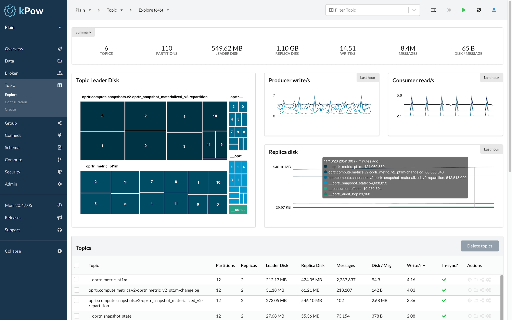

# Introduction

## What is kPow?

### An Engineering Toolkit for Apache Kafka®

kPow is the toolkit that empowers your team to deliver with Kafka.

Once installed, kPow gathers information about your Kafka resources every minute, stores the results locally in internal topics, then provides custom telemetry and insights to you in a rich data-oriented UI.

kPow covers the full surface area of Kafka and associated systems like Kafka Connect and Schema Registry, giving you:

### X-Ray Vision for Apache Kafka

Gain instant visibility of your brokers, topics, groups, partitions, offsets, and more.

