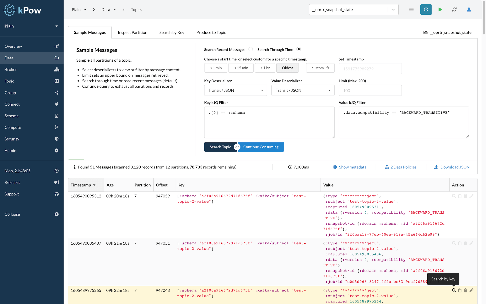
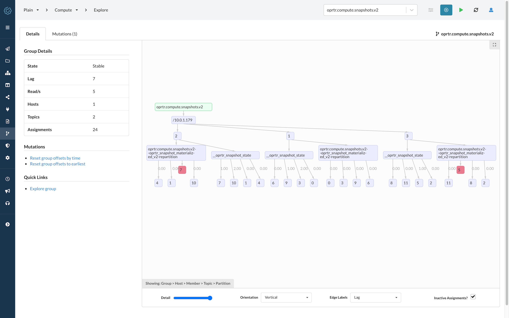

# Introduction

## What is kPow?

### An Engineering Toolkit for Apache Kafka®

kPow is the toolkit that empowers your team to deliver with Kafka.

Once installed, kPow gathers information about your Kafka resources every minute, stores the results locally in internal topics, then provides custom telemetry and insights to you in a rich data-oriented UI.

### X-Ray Vision of Kafka Resources

Gain instant visibility of your brokers, topics, groups, partitions, offsets, and more.

kPow offers full support for controlling and monitoring Kafka Connect clusters and Schema Registries.

### Deep Data Inspect with kJQ

Search **tens of thousands of messages a second** with kPow’s unique, custom implementation of JQ-like queries for Kafka topics.&#x20;

**kJQ** works with JSON or JSON-like data including Apache Avro®, Transit, EDN, and even Protobuf messages where you have configured custom serdes to output JSON formatted text.

### Compute Console to Control and Monitor Streams

Brokers, topics, and the data on them tell only one part of the Kafka story.

kPow Compute provides access to your consumer (and soon, _Kafka Streams_) topologies allowing **visualization of message throughput and lag** at point of consumption and the ability to **reset consumption** at a group, host, member, topic, or assignment level.

### Built for the Enterprise

kPow comes from a practical application of Kafka to real-world requirements and provides:

* **User Authentication** via DB, File, LDAP, SAML, or OpenID configuration.
* **User Authorization** with Simple or Role Based Access Controls (RBAC).
* **Data Policies** for masking and redaction of sensitive data like Credit Card or PII.
* **Data Governance** with all user actions captured in the kPow audit log.
* **Slack Integration** to have user actions sent to an operations channel as they happen.
* **HTTPS** easily configured with your own certificates, or integrated with a reverse-proxy.
* **Prometheus** endpoints to integrate with your preferred metrics and alerting systems.
* **Multi-Cluster Monitoring** from a single installation for cost efficiency and simplicity.
* **All data in local topics** makes kPow perfect for air-gapped environments.

### And Much More..

**Live Mode** for real-time monitoring, **Multi-Dimensional Consumer Lag** insights from kPow's custom derived telemetry, **No Requirement for JMX** access, discover all of our features in this guide.
