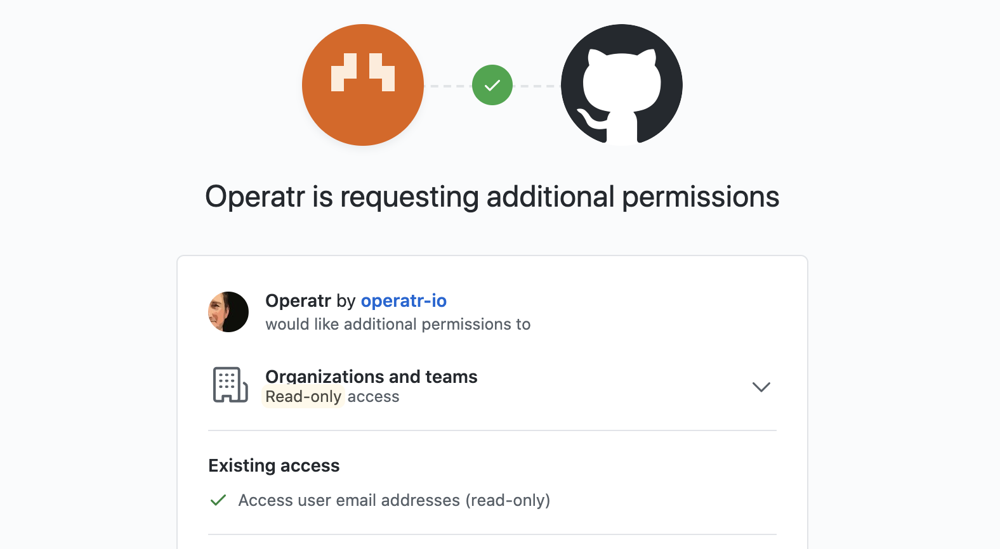

# GitHub


Configure RBAC and set the organisation field to restrict access to your organisation.


## User Authentication

### Create a Github OAuth2 Application

1. Login to [GitHub](https://github.com/) and navigate to the organisation you wish to integrate with kPow.
2. Navigate to **Settings &gt; Developer Settings &gt; OAuth Apps &gt; New Oath Application**
3. Fill out the **Register a new OAuth application** form:
   * **Application Name**: The name of your kPow instance, e.g. 'kPow Staging'.
   * **Homepage URL**: The absolute URL to your kPow instance, e.g. `https://kpow.stage.mycorp.com`
   * **Authorization callback URL**: The absolute URL for authorization callback, e.g. `https://kpow.stage.mycorp.com/oauth2/github/callback`
4. Open your freshly created OAuth App and make note of the **Client ID** and **Client Secret**.

### Integrate kPow with Github OAuth2

Set the following environment variables and start kPow:

* `AUTH_PROVIDER_TYPE=github`
* `OPENID_AUTH_URI=` The URI to authorize Github users, e.g.

  ```text
  https://github.com/login/oauth/authorize, or
  [Github Enterprise Host]/login/oauth/authorize
  ```

* `OPENID_TOKEN_URI=` The URI to retrieve an OAuth token, e.g.

  ```text
  https://github.com/login/oauth/access_token, or
  [Github Enterprise Host]/login/oauth/access_token
  ```

* `OPENID_API_URI=` The URI to perform user actions, e.g.

  ```text
  https://api.github.com/user, or
  [Github Enterprise Host]/api/v3/user
  ```

* `OPENID_CLIENT_ID=` the **Client ID** found in the OAuth Apps page \(required\)
* `OPENID_CLIENT_SECRET=` the **Client Secret** found in the OAuth Apps page \(required\)
* `OPENID_LANDING_URI=` The absolute kPow URI, e.g.

  ```text
  https://kpow.stage.mycorp.org
  ```

kPow will now authenticate users with Github via OAuth2.

## User Authorization

See the guide to [Role Based Access Control](../../authorization/role-based-access-control.md) for full configuration details.

### Integrate Github SSO and RBAC

When RBAC is enabled kPow will request `orgs:read` scope to view the roles associated with an authenticated user.



Github Organisation roles are restricted to `admin` or `member` so they are the two roles you can configure with kPow RBAC when using Github SSO by default. See **role mapping** below to see how to configure kPow to use Github Teams as roles. 

When authenticating a user kPow makes a request to the [GitHub API](https://developer.github.com/v3/orgs/members/#get-organization-membership-for-a-user) for user membership state and role information by querying  `GET /orgs/:org/memberships/:username`.

Specify the `github` key inside your `rbac-config.yaml` to define the Github Organisation to query for role information.

#### Configuration

In this example we grant `admin` users of the `operatr-io` Github Organisation actions `TOPIC_INSPECT` and `TOPIC_PRODUCE` for cluster `N9xnGujkR32eYxHICeaHuQ`.

```text
policies:
  - resource: ["cluster", "N9xnGujkR32eYxHICeaHuQ"]
    effect:   "Allow"
    actions:  ["TOPIC_INSPECT", "TOPIC_PRODUCE"]
    role:     "admin"

# Specifically restrict Auth to a single Github Organization
github:
  org: operatr-io
```

#### Role mapping

By default, kPow will use the authenticated users role in the GitHub organisation as the role in kPow. 

kPow can use the [teams](https://docs.github.com/en/rest/reference/teams) associated with the authenticated user as roles in kPow. You can do this by specifying a custom `roles_field` in the RBAC yaml:

```text
# Specifically restrict Auth to a single Github Organization
# Specify that a user's teams field should be used to identify roles
github:
  org: operatr-io
  roles_field: teams
```

Once enabled, kPow will use the [list teams API call](https://docs.github.com/en/rest/reference/teams#list-teams-for-the-authenticated-user) to query for roles.   
**Note**: this API call requires extra Oauth scopes: `user` and `repo`

