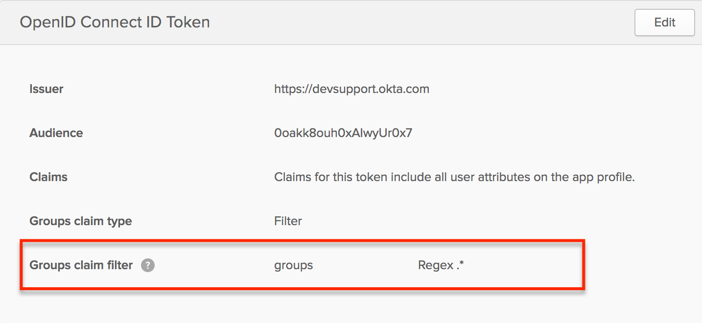

# Okta

## Create an Okta OpenID Application

1. Login to your Okta account.
2. Navigate to **Admin &gt; Applications &gt; Add Application &gt; Create New App.**
3. In **Create a New Application Integration** set these values and click **Create:**
   * **Platform**: Web
   * **Sign on method**: OpenID Connect
4. In **Create OpenID Connect Integration** set these values and click **Save**:
   * **Application name**: The name of your kPow instance, e.g. 'kPow Staging'.
   * **Login redirect URIs**: The absolute kPow callback URI, e.g.  `https://kpow-staging.mycorp.org/oauth2/okta/callback`
5. You will be redirected to the applications settings page.
6. Navigate to **General Settings &gt; Edit**, and configure:  
   **Initiate login URI**: The absolute kPow login URI, e.g:  
   `https://kpow-staging.mycorp.org/oauth2/okta`  

   Optionally, if you would like Okta to appear in your organization's list of Okta apps:

   * **Login initiated by**: "Either Okta or App" selected.
   * **Application visibility**:
     * "Display application icon to users" selected.
     * "Display application icon in the Okta Mobile app" selected.
   * **Allowed grant types**:
     * "Implicit \(Hybrid\)" selected.
       * "Allow ID Token with implicit grant type" selected.
       * "Allow Access Token with implicit grant type" selected.

7. Make note of the **Client Credentials** section that appears below.
8. Click **Assignments** and assign users to kPow.

## Integrate kPow with Okta OpenID

Set the following environment variables and start kPow:

* `AUTH_PROVIDER_TYPE=okta`
* `OKTA_ORGANISATION=` the name of your Okta organization, e.g. **mycorp**
* `OPENID_CLIENT_ID=` the **Client ID** found in **Client Credentials**.
* `OPENID_CLIENT_SECRET=` the **Client Secret** found in **Client Credentials.**
* `OPENID_LANDING_URI=` The absolute kPow URI, e.g:  `https://kpow-staging.mycorp.org`

kPow will now authenticate users with Okta \(OpenID\).

## User Authorization \(RBAC\)

See the guide to [Role Based Access Control](../../authorization/role-based-access-control.md) for full configuration details.

#### Integration

When RBAC is enabled kPow will request `groups` scope to view the groups associated with an authenticated user. kPow considers Okta groups as roles in your RBAC configuration.

You will need to configure a relevant [group claim filter](https://developer.okta.com/docs/guides/customize-tokens-returned-from-okta/create-groups-claim/) for the kPow OpenID integration:

