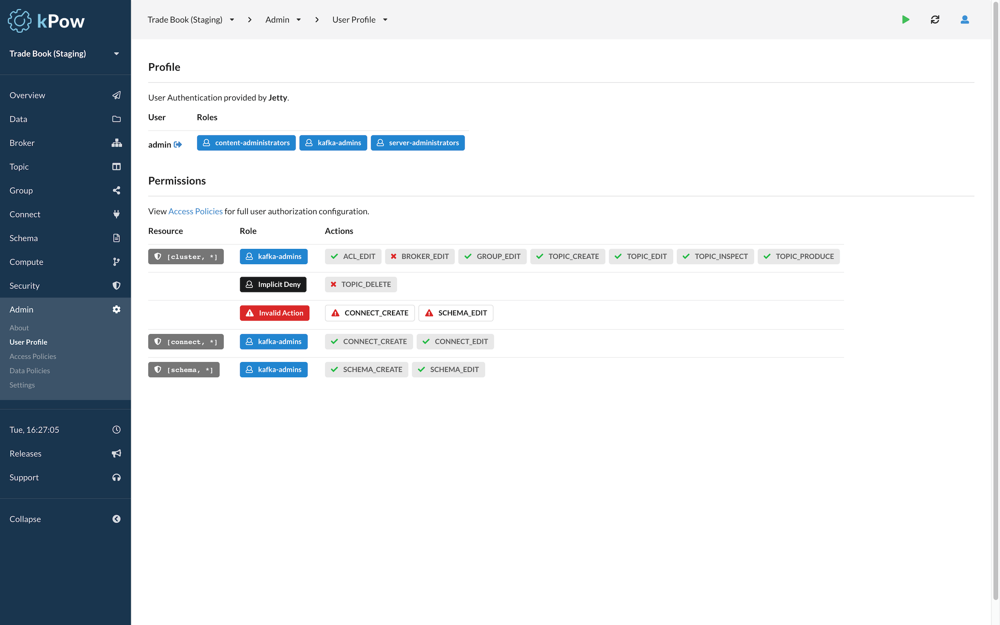

# Overview

kPow supports the following mechanisms for authenticating users.


**Note:** When running kPow with a reverse-proxy for HTTPS termination \(rather than [**HTTPS Connections**](../features/https-connections.md)\) care must be taken the the **scheme** of configured authentication URI.


## Jetty Authentication

kPow is built on the [**Eclipse Jetty Web Server**](https://www.eclipse.org/jetty/)**.**


**See:** The [**Jetty JAAS Documentation**](https://www.eclipse.org/jetty/documentation/current/jaas-support.html) for a full description of authentication options.



**See:** The ****[Application Logs](../install/application-logs.md) guide to enable Jetty JAAS Debug Logging.


Jetty provides a number of JAAS \(Java Authentication and Authorization\) integrations including:

* **PropertyFileLoginModule:** user credentials are stored in a property file.
* **LdapLoginModule:** user credentials are stored in LDAP.
* **JDBCLoginModule:** user credentials are stored in a DB accessed via JDBC.
* **DataSourceLoginModule:** similar to JDBC but uses a JNDI Datasource to connect to the DB.

kPow supports **all of these Jetty JAAS integrations.** Details of each are in this guide.

## SAML Authentication

kPow is easily configured to be a **Service Provider** and integrates with any SAML **Identity Provider**, we include specific guides for [**Azure AD**](saml/azure-ad-integration.md), ****[**Okta**](saml/okta-integration.md) ****and [**AWS SSO**](saml/aws-sso-integration.md) ****in this guide.

## OpenID and OAuth 2.0 Authentication

kPow supports integration with [**Okta**](openid/okta.md) ****\(OpenID\) and [**Github**](openid/github.md) ****\(OAuth 2.0\) SSO providers.


**Need a Provider Added?** Just email **support@operatr.io** and we'll estimate delivery.


## kPow and User Authentication

With authentication configured kPow requires all users to authenticate prior to accessing the UI.


**Note:** Access to Prometheus endpoints remains **unauthenticated.**


When **Jetty Authentication** is configured users will be prompted with form-based or basic login prompts.

Regardless of the mechanism used for authentication, all users can view their profile information.

