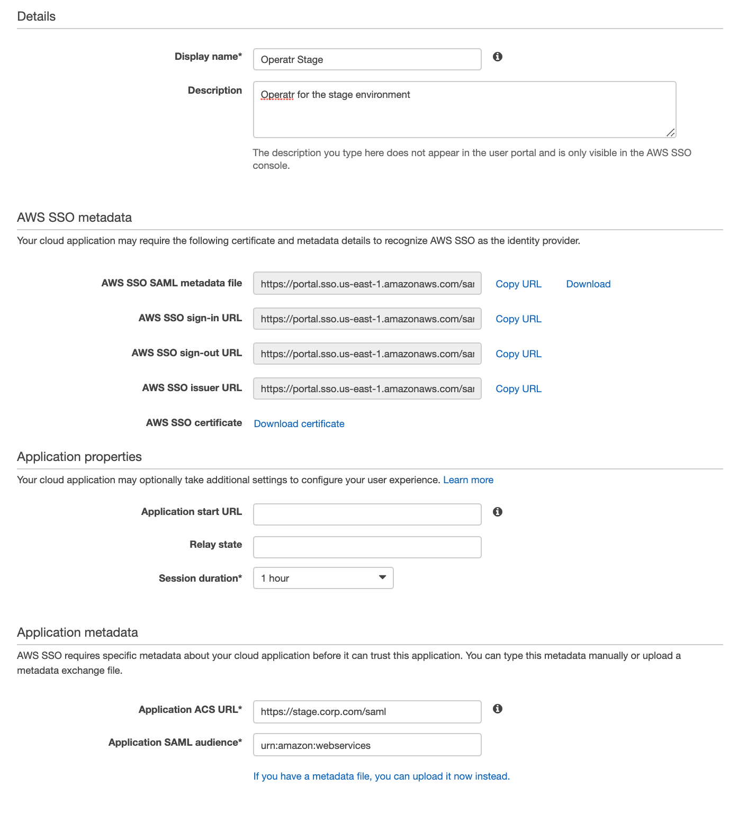
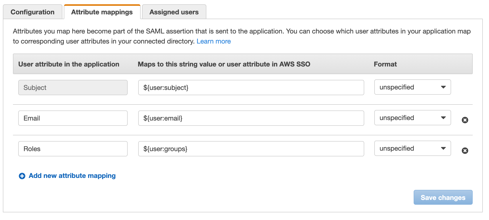
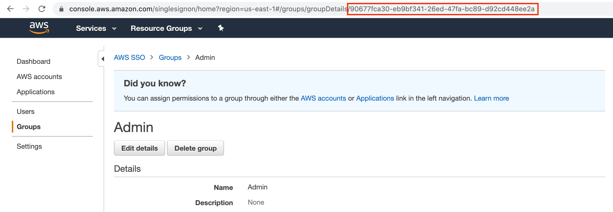

# AWS SSO integration

## User Authentication

### Create an Amazon SSO Application

Inside the **Applications** page of the AWS SSO dashboard, click the **Add New Application** button.

Within the **Add New Application** page, click **Add a Custom SAML 2.0 Application**.

You will see a form like:




#### Application Details

* **Display Name:** the name of the application (e.g. kPow)
* **Description: **the description of the application.


#### AWS SSO Metadata

Download the AWS SSO SAML metadata file and optionally the **AWS SSO Certificate**, these files will be used later to configure kPow.

#### Application Properties

* **Session Duration:** Set to a value that makes sense for your users and security policies.
* **Relay State:** Leave empty.
* **Application Start URL: **Optional, can be left empty.

#### Application Metadata

Select the option to manually type metadata values.

* **Application ACS URL: **Absolute path to your kPow, e.g. **https://kpow.corp.com/saml**
* **Application SMAL Audience: **set to **urn:amazon:webservices**

### Integrate kPow with AWS SSO

Set the following environment variables and start kPow.

```
AUTH_PROVIDER_TYPE=saml
SAML_RELYING_PARTY_IDENTIFIER=[Display Name]
SAML_ACS_URL=[Application ACE URL]
SAML_METADATA_FILE=[path to downloaded AWS SSO SAML metadata file]

# Optional
SAML_CERT=[path to the AWS SSO Certificate .pem file]
```

kPow will now authenticate users with AWS SSO.

## User Authorization

See the guide to [Role Based Access Control](../../authorization/role-based-access-control.md) for full configuration details.

### Integrate AWS SSO and kPow RBAC

Edit the kPow application within the AWS SSO dashboard and navigate to "Attribute Mappings".

Add the following `Roles` mapping to `${user:groups}`:



In this case we are using a user's assigned groups as their role for kPow RBAC configuration.

Each of the `Roles` in this example will have the value of the GUID of the AWS SSO group. You can find the GUID from the AWS console in the URL params:



**Note**: If you are using Active Directory or an external IdP as your identity source for AWS SSO you can use a [supported directory attribute](https://docs.aws.amazon.com/singlesignon/latest/userguide/attributemappingsconcept.html?icmpid=docs_sso_console) like `{dir:....}` that maps to your roles in your Active Directory deployment. For more info visit the [AWS documentation](https://docs.aws.amazon.com/singlesignon/latest/userguide/mapssoattributestocdattributes.html).\
