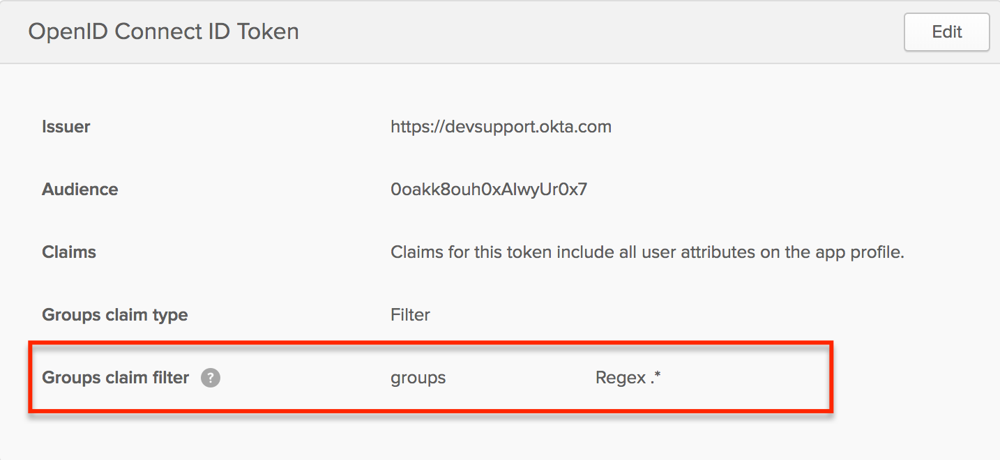

# Okta integration

### Create an Okta SAML Application

Login to your [Okta](https://okta.com) account.

1. Navigate to **Admin > Applications > Add Application > Create New App.**
2. In **Create a New Application Integration** set these values and click **Create:**
   * **Platform**: Web
   * **Sign on method**: SAML 2.0
3.  In **General Settings** set the following values and click **Next**:

    * **App name**: The name of your kPow instance, e.g. 'kPow Staging'.

    Optionally, configure both the app visibility and logo to one's preference.
4. In **Configure SAML** set the following values and click **Next**:
   * **Single sign-on URL**: The absolute kPow login URI, e.g.\
     `https://kpow.corp.com/saml`
   * **Audience URI (SP Entity ID)**: Set to `kPow` or similar.
   * **Attribute statements**:
     * `Email` -> can be mapped to `user.email` using the `unspecified` name format
   * **Group attribute statements:**
     * `Roles` -> can be mapped to a relevant group filter for [Role Based Access Control](https://support.operatr.io/hc/en-us/articles/900002019823)
5. Navigate to **Feedback > Finish **and you will be redirected to your new Okta application.
6.  Navigate to  **Sign On > View Setup Instructions** and save the XML in **Provide the following IDP metadata to your SP provider **to a file on disk. 


### Integrate kPow with Okta SAML

### Set the following environment variables and start kPow:

* `AUTH_PROVIDER_TYPE=saml`
* `SAML_RELYING_PARTY_IDENTIFIER=` the **Audience URI (SP Entity ID)**
*   `SAML_ACS_URL=` the **Single sign-on URL, **e.g.

    ```
    https://kpow.corp.com/saml
    ```
*   `SAML_METADATA_FILE=` the path to the **IDP metadata **file, e.g.

    ```
    /var/saml/saml-idp-metadata.xml
    ```

kPow will now authenticate users with Okta (SAML).\


### User Authorization

See the guide to [Role Based Access Control](../../authorization/role-based-access-control.md) for full configuration details.

### Integrate Okta SSO (OpenID) and RBAC

When RBAC is enabled kPow will request `groups` scope to view the groups associated with an authenticated user. kPow considers Okta groups as roles in your RBAC configuration.

You will need to configure a relevant [group claim filter](https://developer.okta.com/docs/guides/customize-tokens-returned-from-okta/create-groups-claim/) for the kPow OpenID integration:


