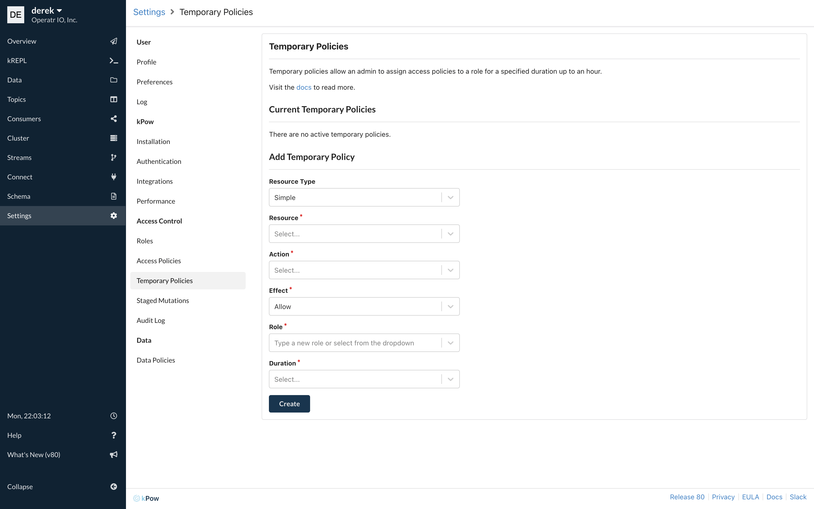

# Administration

## kPow Admins

User roles can be specified as administrators of kPow.

kPow Admins have access to the full kPow Admin UI and admin specific features like creating temporary RBAC policies and managing staged mutation requests.



Admin roles are specified within your [Role Based Access Control](../role-based-access-control.md#admin-roles) configuration.

```yaml
admin_roles:
  - "kafka-admin"
```

## Features

### Temporary Policies

View the documentation for temporary policies [here](temporary-policies.md)

### Staged Mutations

View the documentation for staged mutations [here](staged-mutations.md)

### 


