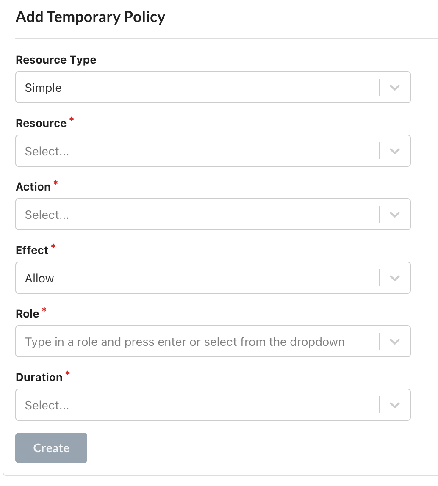
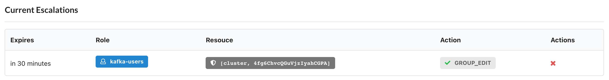

# Temporary Policies

## Temporary Policies

Temporary Policies allow an admin to create temporary RBAC policies.

For example a Temporary Policy may grant `GROUP_EDIT` on a specific consumer group for a specific cluster for 30 minutes to a specific user role. 

Setting temporary policies is a feature available to [kPow Admins](./#administrators).

**Note**: an admin cannot assign temporary policies above their own permissions. For example, if creating a temporary policy for `GROUP_EDIT` , the admin must also be allowed to invoke `GROUP_EDIT` actions.

### Adding a temporary policy

From within the **Settings** page an administrator can navigate to the **Temporary Policies** tab.

### Viewing/managing temporary policies

From within the **Settings** page an administrator can navigate to the **Temporary Policies** tab.

You can view all current temporary policies and remove temporary policies before they expire.

### Notifications

You can configure the [Slack integration](../../features/slack-integration.md) to be notified when a new temporary policy has been made. 

All temporary policies are persisted to the [audit log](../../features/data-governance.md).

