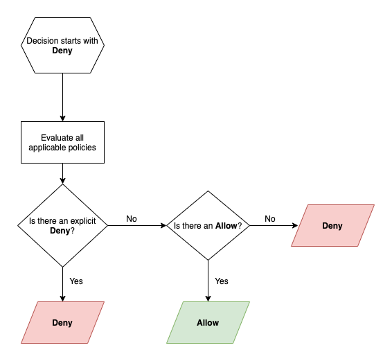

# Role Based Access Control

Role Based Access Control (RBAC) provides **fine-grained control** of user actions.

RBAC integrates with [**User Authentication**](../authentication/overview.md), leveraging roles assigned to users in the credentials system of your choice. User roles are granted ALLOW, DENY, or STAGE to actions on specific resources.

RBAC configuration is defined in a YAML file and configured with an environment variable:

```
RBAC_CONFIGURATION_FILE=/path/to/rbac-config.yaml
```

## Authorized Roles

kPow will restrict UI access to users who have **at least one role** defined in the RBAC configuration.

You may override this behaviour by providing a **specific list of `authorized_roles`** in your config.

```yaml
## Allow all users access to the UI ("*" is a role held by everyone)
authorized_roles:
  - "*"
  
## Or, allow users with specific roles access to the UI
authorized_roles:
  - "kafka-user"
  - "kafka-admin"
  - "ops-support"
```

## Admin Roles

You can optionally provide `admin_roles`, a list of roles considered to be admins in kPow.

You can learn more about administration in kPow [here](administration/).

```yaml
admin_roles:
  - "kafka-admin"
```

## Policies

An RBAC policy contains:

* **Resource**: The resource that this policy controls access to
* **Effect**: Whether to **deny,** **allow,** or **stage** access to the **Resource**
* **Actions**: A list of actions that this policy **Effects**

Then either:

* **Role:** The user role that this policy applies to
* **Roles:** The list of user roles that this policy applies to

### Example Configuration

The following configuration applies controls to three roles and **permits all authenticated users access**.


**Note:** Where multiple policies apply to one resource, **Deny** effects take precedence.


```yaml
authorized_roles:
  - "*"
  
policies:
  - resource: ["cluster", "N9xnGujkR32eYxHICeaHuQ"] 
    effect:   "Allow" 
    actions:  ["TOPIC_INSPECT", "TOPIC_PRODUCE", "TOPIC_EDIT"] 
    role:     "kafka-admin"
  - resource: ["cluster", "N9xnGujkR32eYxHICeaHuQ", "topic", "tx_audit"]
    effect:   "Deny"
    actions:  ["TOPIC_PRODUCE", "TOPIC_EDIT"]
    role:     "kafka-admin"
  - resource: ["cluster", "*"]
    effect:   "Allow" 
    actions:  ["GROUP_EDIT"] 
    roles:    ["kafka-admin"]
  - resource: ["cluster", "*", "group", "tx_*"]
    effect:   "Stage" 
    actions:  ["GROUP_EDIT"] 
    roles:    ["kafka-user"] 
```

**`kafka-admin`** is allowed to inspect, produce, and edit all topics **in a specific cluster**, then explicitly denied produce and edit actions to **one specific topic in that same cluster**.&#x20;

**`kafka-admin`** is then permitted group edit permissions on all clusters, **`kafka-user` ** are permitted stage access to the group edit action for groups starting with `tx_` -  stage meaning the request will have to be confirmed by an admin user.

All remaining actions are **implicitly denied** actions to all users on all resources.

## Resources

Resources are defined within a [taxonomy](https://en.wikipedia.org/wiki/Taxonomy\_\(biology\)) that describes **the hierarchy of objects** in kPow.

```
[DOMAIN_TYPE, DOMAIN_ID, OBJECT_TYPE?, OBJECT_ID?]
```

Where:

* **Domain Type**: The top-level resource, either **cluster**, **schema**, or **connect**
* **Domain ID:** Unique identifier of the domain or "**\***" **for all/wildcard**
* **Object Type:** Either **topic, group, connector, subject,** or **broker**
* **Object ID:** Unique identified of the object. Prefix and Suffix supported

**Specifying the object is optional.** If not provided the resource includes all objects within a domain.

### Example Resources

```
["cluster", "*"] - all clusters and all objects
["cluster", "*", "topic"] - all topics on all clusters
["cluster", "N9xnGujkR32eYxHICeaHuQ"] - all objects in a cluster
["cluster", "*", "topic", "tx-events"] - named topic in all clusters
["schema", "*"] - all schema registries and all objects
["schema", "*", "subject", "tx-events"] - named subject in all schema registries
["connect", "*"] - all connect clusters and all objects
["connect", "*", "connector", "csv-*"] - matching connector in all connect clusters
```

### Resource IDs

kPow **logs the IDs of all top-level domains** at startup.

```
 Connected to [2] Kafka clusters:
 * g10tMLohRLKthriTt0749g (Local):
   - kafka connect: http://kafka:8083 (g10tMLohRLKthriTt0749g)
   - schema registry not configured
 * lkc-lo019 (Confluent Cloud):
   - kafka connect not configured
   - schema registry: https://xxx.us-east-2.aws.confluent.cloud (a2f06a916672d71d675f) (Confluent Cloud)
```

In the example above we have four **domain** resources:

* Two Kafka Clusters (`g10tMLohRLKthriTt0749g`, `lkc-lo0o9`)
* One Kafka Connect Cluster (`g10tMLohRLKthriTt0749g`)
* One Schema Registry (`a2f06a916672d71d675f`)

#### Resource ID Definitions

* **Kafka Cluster:** - the ID of the Kafka cluster as returned by a broker
* **Kafka Connect:** the ID of the Kafka cluster associated with the Kafka Connect installation
* **Schema Registry:** a SHA256 hash of the Schema Registry endpoint

## Effects

Specify `Allow`, `Deny` or `Stage` to indicate whether the policy allows or denies access to a resource. View [Staged mutations](administration/#staging-mutations) documentation to learn about the `Stage` effect.&#x20;

Where no matching policy exists the effect is an **implicit deny.**

## Actions

See: [**User Actions**](overview.md#user-actions).

## Roles

Define a user role to which you would like to allow or deny access.

Can be a wildcard (**\***) to **specify the policy is for all roles**.

### Role Evaluation

User access to an action on a resource is determined by gathering all policies for roles assigned to a user and evaluating them with the following logic.



## User Access Governance

All actions are retained in the kPow Audit Log. See: [**Data Governance**](../features/data-governance.md)**.**

## Role Mapping

To use RBAC you must configure [**User Authentication**](../authentication/overview.md) **** and ensure users have assigned roles.

### Integration Guides

Below are integration guides for common authentication providers:

* [GitHub OpenID](../authentication/openid/github.md#user-authorization)
* [Okta OpenID](../authentication/openid/okta.md#user-authorization-rbac)
* [Okta SAML](../authentication/saml/okta-integration.md#user-authorization)
* [AWS SSO SAML](../authentication/saml/aws-sso-integration.md#user-authorization)
* [Azure AD SAML](../authentication/saml/azure-ad-integration.md#user-authorization)

### SAML Integration (Generic)

kPow can integrate with your SAML IdP as a service provider.

Roles are defined in a `Roles` attribute in the SAMLResponse from your IdP.

If you would like to use a field other than the `Roles` attribute, you can extend the YAML configuration as follows:&#x20;

```
saml:
  role_field: "Groups"
```

Now, kPow will look to the `Groups` attribute for its basis of roles.
