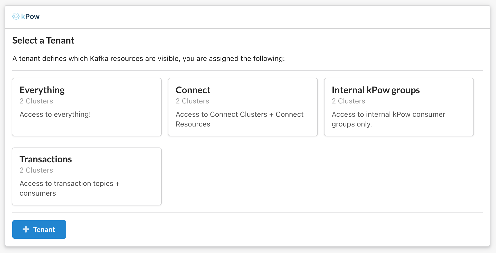
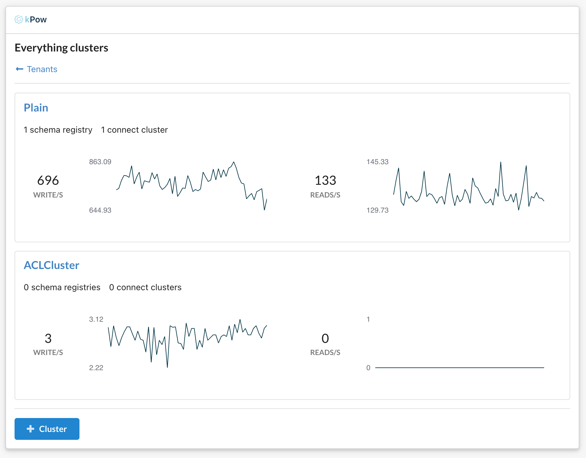
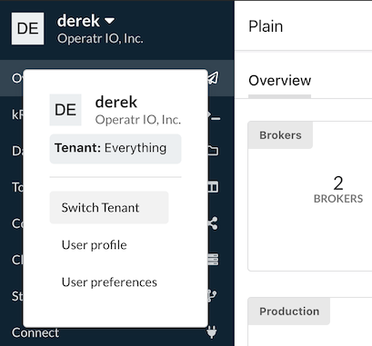

# Multi-Tenancy

## Introduction

### **What is Multi-Tenancy?**

A tenant restricts the set of Kafka resources that are accessible to a user role from all the resources available to kPow. A user role may be assigned multiple tenants.

Tenancy configuration is provided within your Role Based Access Configuration YAML file.

### What is a Tenant?

A tenant is defined in configuration, specifically it can:

* Include or exclude specific topics or topic prefixes, e.g. tx-topic, tx-top\*
* Include or exclude specific groups or group prefixes, e.g. tx-group, tx-grou\*
* Include or exclude specific resources, e.g Kafka clusters, Schema registries, or Connect clusters
* Be assigned to one or many user roles

### What is 

Where a user has multiple tenants they are provided the options to choose a tenant to access.



Once a tenant is selected the user the chooses a cluster \(if multi-cluster is configured\)



A user can switch tenants at any time by selecting the top-left user context menu



**Example Tenancy Scenario**

kPow is connected to three Kafka Clusters \(Dev, UAT, Prod\), each having 200 topics and 200 groups, two Connect installations and one Schema Registry. ****You can create a tenant that:

* Contains only Kafka resources connected to or within Dev and UAT \(or any combination of clusters\)
* Contains only specific topics or groups, or matches them with a prefix. E.g `my-topic` or `my-grou*`
* Includes or Excludes Connect or Schema resource in their entirety \(more granular control shortly\)
* Any combination of the above.

## Configuration

Within your [RBAC yaml configuration file](role-based-access-control.md) you can specify a top-level `tenants` key:

```yaml
tenants:
  - name: "Default"
    description: "All Kafka Resources."
    resources:
      - include:
          - [ "*" ]
    roles:
      - "kafka-admins"
  - name: "Admins"
    description: "Data belonging to the admins."
    resources:
      - include:
          - [ "cluster", "*", "topic", "oprtr*" ]
          - [ "cluster", "*", "topic", "__oprtr*" ]
          - [ "cluster", "*", "group", "oprtr*" ]
          - [ "connect", "*" ]
          - [ "schema", "*" ]
    roles:
      - "kafka-admins"
  - name: "Users"
    description: "Data belonging to users."
    resources:
      - include:
          - [ "cluster", "*" ]
      - exclude:
          - [ "cluster", "*", "group", "oprtr.compute.metrics.v2"]
          - [ "cluster", "*", "topic", "oprtr*" ]
    roles:
      - "kafka-users"
```

These tenants relate to internal kPow topics and groups for demonstration purposes and use the same  roles as our Jetty PropertyFileLoginModule example.

Kafka Admins have two tenants to choose from, Default contains all resources, Admins contains a subset of resources. Kafka Users has one tenant that is automatically selected for them with an even smaller subset of resources included.

### name

| Key | Required | Type | Description |
| :--- | :--- | :--- | :--- |
| name | Y | String | The name of the tenant. |

The `name` field will be the assigned name of the tenant used within kPow's UI. It must be unique.

### description

| Key | Required | Type | Description |
| :--- | :--- | :--- | :--- |
| description | N | String | The description of the tenant. |

The optional `description` field will be used within kPow's UI as a description when switching tenants. 

### resources

| Key | Required | Type | Description |
| :--- | :--- | :--- | :--- |
| resources | Y | List | A list of resources either included or excluded for this tenant. |

The `resources` field defines which resources are either included or excluded for this tenant.

Each item in the list is a map of either `include: [resource...]` or `exclude: [resouce... ]` 

Where the resource refers to the path of the object you wish to include/exclude. 

For example: `["cluster",  "*", "topic", "tx_*"]`refers to any topic matching `tx_*`for any Kafka cluster defined in kPow.

### roles

| Key | Required | Type | Description |
| :--- | :--- | :--- | :--- |
| roles | Y | List | The list of roles assigned to this tenant. |

The `roles` field describes which roles \(specified from your [authentication provider](../authentication/overview.md#kpow-and-user-authentication)\) are assigned to this tenant.

For more details about resources refer to the [RBAC documentation](role-based-access-control.md#resources). 

