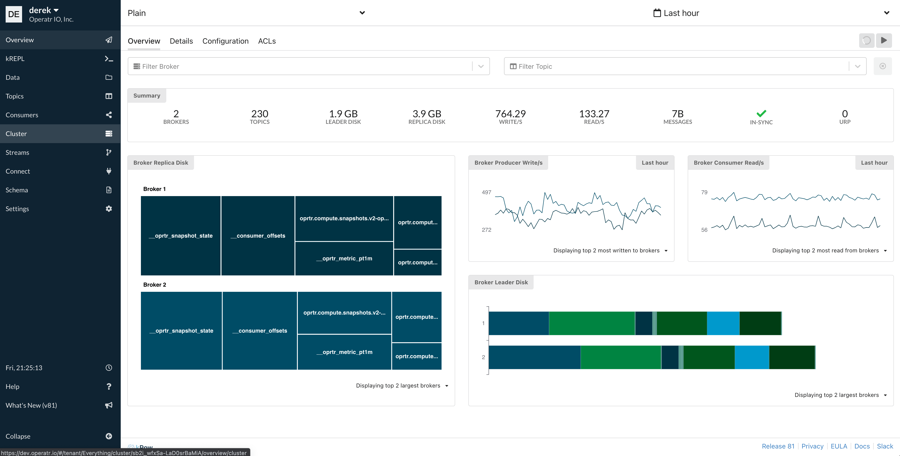
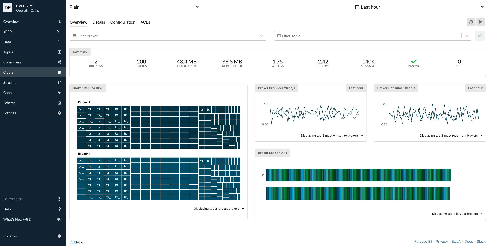

# Multi-Tenancy

## Introduction

### **What is Multi-Tenancy?**

A tenant restricts the set of Kafka resources that are accessible to a user role from all the resources available to kPow. A user role may be assigned multiple tenants.

When operating within a tenant a user can only see resources included by that tenant, they will also see a fully consistent synthetic cluster-view of their aggregated resources. The overall user experience is simply of a restricted set of Kafka resources as if they were truly the only resources in the system.


Tenancy restricts more that visibility, a user can also only **create** resources valid to their tenant.


Tenancy configuration is provided within your Role Based Access Configuration YAML file.

### What is Multi-Tenancy for?

Primarily to provide different views of Kafka resources to different teams within your organisation.

Consider the following scenario:

kPow is connected to three Kafka Clusters \(Dev, UAT, Prod\), each having 200 topics and 200 groups, two Connect installations and one Schema Registry. ****You can create a tenant that:

* Contains only Kafka resources connected to or within Dev and UAT \(or any combination of clusters\)
* Contains only specific topics or groups, or matches them with a prefix. E.g `my-topic` or `my-grou*`
* Includes or excludes Connect or Schema resource in their entirety \(more granular control shortly\)
* Any combination of the above.

The secondary use is to exclude groups and topics of no interest to your organisation.

For example, kPow provides two default tenants when you have none specifically configured: 

* Global: All Kafka resources
* kPow Hidden: All Kafka resources with kPow internal groups and topics excluded

### What is a Tenant?

A tenant is defined in configuration, specifically it can:

* Include or exclude specific topics or topic prefixes, e.g. tx-topic, tx-top\*
* Include or exclude specific groups or group prefixes, e.g. tx-group, tx-grou\*
* Include or exclude specific resources, e.g Kafka clusters, Schema registries, or Connect clusters
* Be assigned to one or many user roles

## Configuration

Within your [RBAC yaml configuration file](role-based-access-control.md) you can specify a top-level `tenants` key:

This configuration matches the **default tenants** that kPow provides if you have none configured.

```yaml
tenants:
  - name: "Global"
    description: "All configured Kafka resources."
    resources:
      - include:
          - [ "*" ]
    roles:
      - "*"
  - name: "kPow Hidden"
    description: "All configured Kafka resources except internal kPow resources and __consumer_offsets."
    resources:
      - exclude:
          - [ "cluster", "*", "topic", "oprtr*" ]
          - [ "cluster", "*", "topic", "__oprtr*" ]
          - [ "cluster", "*", "topic", "__consumer_offsets" ]
          - [ "cluster", "*", "group", "oprtr*" ]
    roles:
      - "*"
```

### Fields

Each tenant is configured with a name, description, resources, and roles.

### name

| Key | Required | Type | Description |
| :--- | :--- | :--- | :--- |
| name | Y | String | The name of the tenant. |

The `name` field will be the assigned name of the tenant used within kPow's UI. It must be unique.

### description

| Key | Required | Type | Description |
| :--- | :--- | :--- | :--- |
| description | N | String | The description of the tenant. |

The optional `description` field will be used within kPow's UI as a description when switching tenants. 

### resources

| Key | Required | Type | Description |
| :--- | :--- | :--- | :--- |
| resources | Y | List | A list of resources either included or excluded for this tenant. |

The `resources` field defines which resources are either included or excluded for this tenant.

Each item in the list is a map of either `include: [resource...]` or `exclude: [resouce...]` 

Where the resource refers to the path of the object you wish to include/exclude. 

For example: `["cluster",  "*", "topic", "tx_*"]`refers to any topic matching `tx_*`for any Kafka cluster defined in kPow.

### roles

| Key | Required | Type | Description |
| :--- | :--- | :--- | :--- |
| roles | Y | List | The list of roles assigned to this tenant. |

The `roles` field describes which roles \(specified by your [auth provider](../authentication/overview.md#kpow-and-user-authentication)\) are assigned to this tenant.

For more details about resources refer to the [RBAC documentation](role-based-access-control.md#resources). 

## User Experience

kPow users with a single tenant are automatically entered into that tenant on session start.

kPow users with multiple tenants have the option of choosing and switching tenant:


Once a tenant is selected the user the chooses a cluster \(if multi-cluster is configured\)


A user can switch tenants at any time by selecting the top-left user context menu


Once a tenant is selected the user is presented an internally consistent view of a synthetic set of Kafka resources that matches the tenant exactly.

Here is an example of the Cluster view in two tenants in our demo environment.

Each tenant provides a different synthetic view of the Kafka resources configured with kPow.

### **Global Tenant**

This tenant has 230 topics, 3.9GB replica disk and is receiving 762 writes/s



### Transaction Tenant

This tenant has 200 topics, 86.8MB replica disk and is receiving 1.75 writes/s.

It looks strikingly different because `tx-*` topics are generated event topics in our demo environment.




