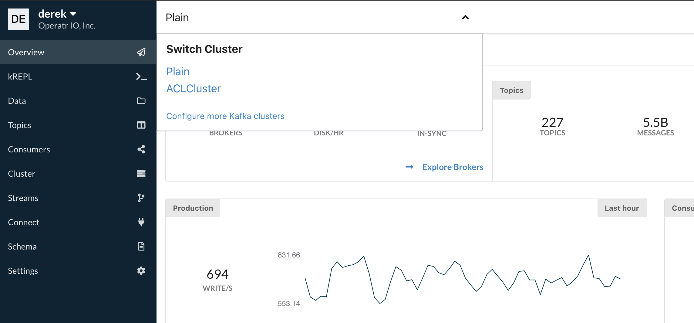

# Multi-Cluster Management


Multi-cluster **does not mean multi-region,** install kPow in proximity to your Kafka resources.


One instance of kPow can manage multiple Apache Kafka clusters \(and their associated resources\).



When configuring multiple clusters, the **first configured cluster is your primary cluster.**

The primary cluster holds the kPow internal topics. You can switch the primary cluster at any time.

## Resources

kPow will manage as many clusters as your license permits - you may have to increase the memory and CPU to ensure that the regular snapshotting process executes within thirty seconds.

Information on snapshotting performance of each cluster is available at 'settings -&gt; performance'.

## Configuration

To configure multiple clusters, simply repeat the connection configuration with \_2, \_3, \_4 suffixes:

```text
# Cluster 1, Vanilla Apache Kafka

ENVIRONMENT_NAME=Trade Book (Staging)
BOOTSTRAP=kafka-1:19092,kafka-2:19093,kafka-3:19094
SECURITY_PROTOCOL=SASL_PLAINTEXT
SASL_MECHANISM=PLAIN
SASL_JAAS_CONFIG=org.apache.kafka.common.security.plain.PlainLoginModule required username="admin" password="admin-secret";

# Cluster 2, Confluent Cloud + Schema Registry

ENVIRONMENT_NAME_2=Outbound Payments (Staging)
BOOTSTRAP_2=pkc-1234.us-east-1.aws.confluent.cloud:9092
SECURITY_PROTOCOL_2=SASL_SSL
SASL_MECHANISM_2=PLAIN
SASL_JAAS_CONFIG_2=org.apache.kafka.common.security.plain.PlainLoginModule required username="..." password="...";
SSL_ENDPOINT_IDENTIFICATION_ALGORITHM_2=https
SCHEMA_REGISTRY_URL_2=https://psrc-1234.us-east-2.aws.confluent.cloud
SCHEMA_REGISTRY_AUTH_2=USER_INFO
SCHEMA_REGISTRY_USER_2=...
SCHEMA_REGISTRY_PASSWORD_2=...

# Cluster 3, etc.ENVIRONMENT_NAME_3=...
```

