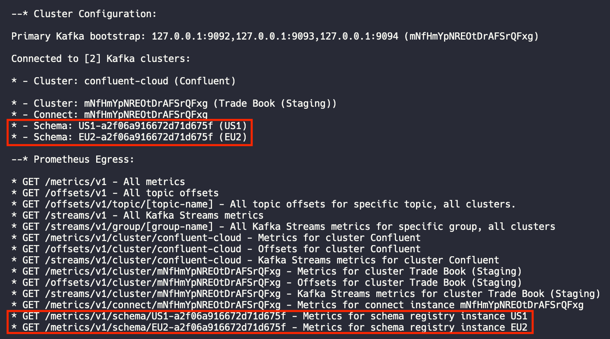
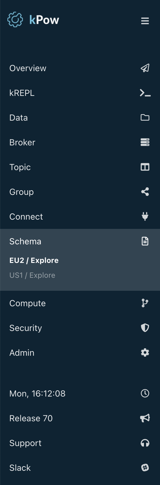

# Schema Registry

## Access Control

User permissions to Kafka cluster resources are defined by [**Schema actions.**](../authorization/overview.md#user-actions)\*\*\*\*

## **Configuration**

kPow connects to a Schema registry with **environment variables**.

| Variable | Description |
| :--- | :--- |
| **SCHEMA\_REGISTRY\_NAME** | UI and logs friendly name for this Schema registry |
| **SCHEMA\_REGISTRY\_URL** | The client connection URL for your registry |
| **SCHEMA\_REGISTRY\_AUTH** | USER\_INFO if basic authentication is configured |
| **SCHEMA\_REGISTRY\_USER** | Username if basic authentication is configured |
| **SCHEMA\_REGISTRY\_PASSWORD** | Password if basic authentication is configured |
| **SCHEMA\_REGISTRY\_RESOURCE\_IDS** | Optional, comma separated list of unique ids. Only specify when configuring multiple [s](kafka-connect.md#configuring-multiple-connect-clusters)chema registries. |

### Configuring Multiple Schema Registries


This feature is in pre-release. Email support@operatr.io if you would like to receive a pre-release JAR!


This feature is in pre-release. Email support@operatr.io if you would like to receive a pre-release JAR!

kPow supports many Schema Registries associated to a single Kafka cluster. 

To configure multiple Schema Registries, use the environment variable `SCHEMA_REGISTRY_RESOURCE_IDS` to define a comma separated list of Schema Registries. kPow uses the resource ID as a prefix in the environment variable.

Example configuration when configuring two Schema Registries:

```text
SCHEMA_REGISTRY_RESOURCE_IDS=US1,EU2

US1_SCHEMA_REGISTRY_URL="https://us1.schema-registry.mycorp.org"
US1_SCHEMA_REGISTRY_AUTH="USER_INFO"
US1_SCHEMA_REGISTRY_USER="****"
US1_SCHEMA_REGISTRY_PASSWORD="****"

EU2_SCHEMA_REGISTRY_URL="https://us1.schema-registry.mycorp.org"
EU2_SCHEMA_REGISTRY_AUTH="USER_INFO"
EU2_SCHEMA_REGISTRY_USER="****"
EU2_SCHEMA_REGISTRY_PASSWORD="****"
```





