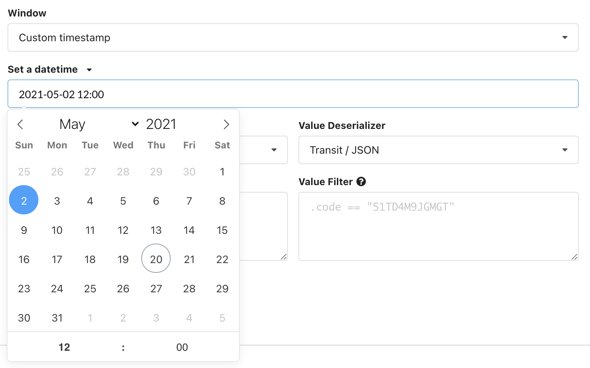
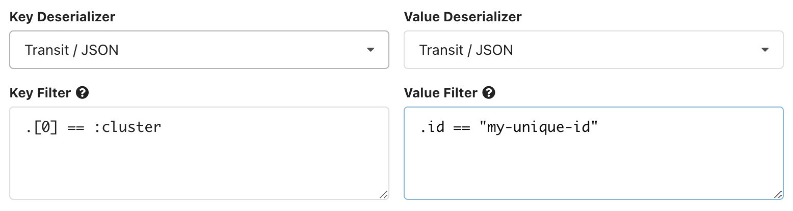
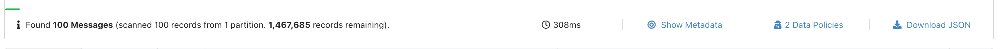
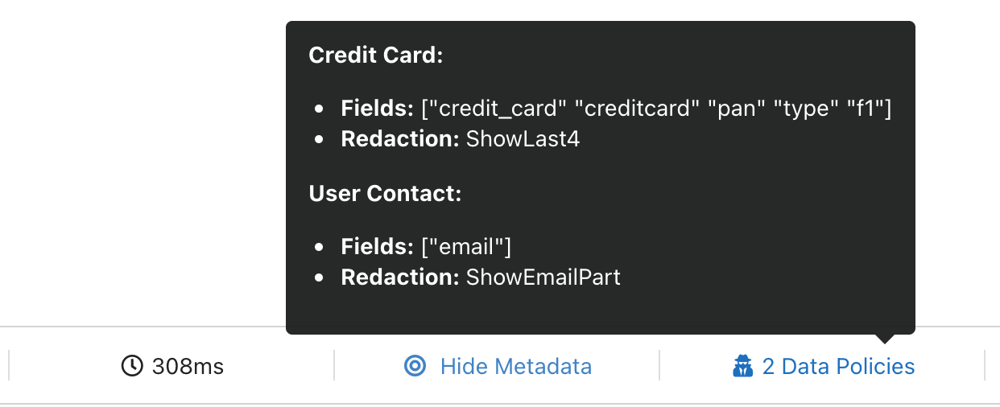

# Data Inspect

## Usage

### Mode 

Data Inspect has three different modes when searching topics:

* **Sample**: this will scan for records across an even distribution of partitions. You can use the [result metadata](./#result-metadata-table-explanation) from the search results to see which partitions have been scanned.
* **Partition**: this allows for records to be scanned across a specific partition and optional offset.
* **Key**: this will scan for absolute matches of the key text provided. The search will only scan the partition the key belongs to.

### Window

You can specify the starting point for where data inspect will scan for records on a topic. By default kPow will search for recent messages on a topic. From the "Window" dropdown you can specify a custom timestamp or datetime for your starting point.

### Serdes


By default, the `TOPIC_INSPECT` access policy is disabled. To view the contents of messages in the data inspect UI, read our [Data Policies](../data-policies.md) documentation to configure.


See the [Serdes](serdes.md) section for more information about using Data Inspect serdes.

### Filtering

If you have selected a key or value serdes for the data inspect query, you can also apply an optional filter to your query. See the [kJQ Filters](kjq-filters.md) section for documentation on the query language.

### Headers

If you check **"Include Message Headers?"** in the data inspect form, data inspect will also return the contents of each records header, deserialized as a JSON map. You can also filter headers in the same way as any key/value kJQ filters.

## Query Results

### Results Toolbar

#### Query progress

Data inspect queries have a **start and end cursor position.** The start is defined by the [window](./#window) of the query, and the end position is the time in which the query was first executed. Once a query has been executed, the query metadata has the notion of "progress": how many records you have scanned, and how many records remain for the query. The green progress bar above the toolbar represents the total progress of the query. You can always click **"Continue consuming"** to keep progressing your cursor.

#### Data Policies 

If you have any [Data policies](../data-policies.md) that apply to the query that was executed, the toolbar will show you what policies matches your queries, and the redactions applied.

### Result Metadata Table

Clicking the **"Show metadata"** button ****in the results toolbar will expand the Result Metadata Table, which is a table of your queries cursors across all partitions. 

#### Result Metadata Table Explanation

* **Partition:** the partition ****the row relates to
* **Partition start**: the earliest offset of this partition
* **Partition end**: the most recent offset of this partition 
* **Query start**: the offset that data inspect started scanning from for this partition. Calculated from the query window.
* **Query end**: the offset that data inspect will scan up to. Calculated from the query window.
* **Scanned Records:** the number of records in this partition that have been scanned
* **Filtered Records**: the number of records that have positively matched the key or value filters specified in the query
* **Remaining Records**: the number of records that remain in the query window.
* **Consumed:** the percentage of overall records consumed ****for this partition**.**

## Configuration

### Engine

`SAMPLER_CONSUMER_THREADS` - kPow creates a connection pool of consumers when querying with data inspect. This environment variables specifies the number of consumer threads globally available in the pol. Default: 6.

`SAMPLER_TIMEOUT_MS` - a query will finish querying once 100 **positively matched** records have been found or after a timeout \(default 7s\). You can always progress the query and continue scanning by clicking "Continue Consuming".

Increase the sampler timeout to run longer queries and the consumer threads to query more partitions in parallel.

The default configuration _should be suitable for most installations_.

### Serdes

See the [Serdes](serdes.md) section for details on how to configure custom serdes and more for data inspect.  
  

