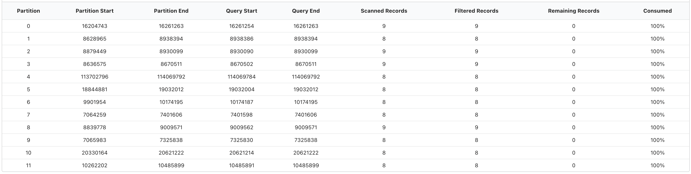

# Data Inspect

## Usage

### Mode 

Data Inspect has three different modes when searching topics:

* **Sample**: scan for records across an even distribution of partitions.
* **Partition**: scan for records within a specific partition and optional offset.
* **Key**: scan for absolute matches of the key text provided.

### Window

Specify the starting point for where data inspect will scan for records on a topic. 

By default kPow will search for recent messages on a topic. From the "Window" dropdown you can specify a custom timestamp or datetime for your starting point.

### Serdes


By default, the `TOPIC_INSPECT` access policy is disabled. To view the contents of messages in the data inspect UI, see the [configuration](./#serdes-1) section of this document.


See the [Serdes](serdes.md) section for more information about using Data Inspect serdes.

### Filtering

kPow offers very fast JQ-like filters for search data on topics. These filters are compiled and executed on the server, allowing you to search tens of thousands of messages a second.

See the [kJQ Filters](kjq-filters.md) section for documentation on the query language.

### Headers

Select a Headers Deserializer in the Data Inspect for to include Message Headers in your results.

## Query Results

### Results Toolbar

#### Query progress

Data inspect queries have a **start and end cursor position.** The start is defined by the [window](./#window) of the query, and the end position is the time in which the query was first executed. Once a query has been executed, the query metadata has the notion of "progress": how many records you have scanned, and how many records remain for the query. The green progress bar above the toolbar represents the total progress of the query. You can always click **"Continue consuming"** to keep progressing your cursor.

#### Data Policies 

If you have any [Data policies](../data-policies.md) that apply to the query that was executed, the toolbar will show you what policies matches your queries, and the redactions applied.

### Result Metadata Table

Clicking the **"Show metadata"** button ****in the results toolbar will expand the Result Metadata Table, which is a table of your queries cursors across all partitions. 

#### Result Metadata Table Explanation

* **Partition:** the partition ****the row relates to
* **Partition start**: the earliest offset of this partition
* **Partition end**: the most recent offset of this partition 
* **Query start**: the offset that data inspect started scanning from for this partition. Calculated from the query window.
* **Query end**: the offset that data inspect will scan up to. Calculated from the query window.
* **Scanned Records:** the number of records in this partition that have been scanned
* **Filtered Records**: the number of records that have positively matched the key or value filters specified in the query
* **Remaining Records**: the number of records that remain in the query window.
* **Consumed:** the percentage of overall records consumed ****for this partition**.**

## Configuration

### Engine

`SAMPLER_CONSUMER_THREADS` - kPow creates a connection pool of consumers when querying with data inspect. This environment variables specifies the number of consumer threads globally available in the pol. Default: 6.

`SAMPLER_TIMEOUT_MS` - a query will finish querying once 100 **positively matched** records have been found or after a timeout \(default 7s\). You can always progress the query and continue scanning by clicking "Continue Consuming".

Increase the sampler timeout to run longer queries and the consumer threads to query more partitions in parallel.

The default configuration _should be suitable for most installations_.

### Serdes

#### Custom serdes + serdes configuration

See the [Serdes](serdes.md) section for details on how to configure custom serdes, integrate schema registry and more for data inspect.

#### TOPIC\_INSPECT authorization

To enable inspection of key/value/header contents of records, set the `TOPIC_INSPECT` environment variable to `true`. If you are using role-based access control, view our guide [here](https://docs.kpow.io/authorization/role-based-access-control#example-configuration).

#### Data policies/redaction

To configure data policies \(configurable redaction of Data Inspection results**\)** view our [Data Policies guide](../data-policies.md).

  

