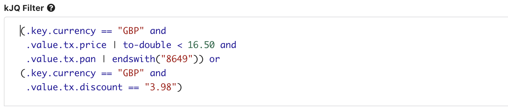

# kJQ Filters

## Overview

[**JQ**](https://stedolan.github.io/jq/) is a popular, practical language described as 'like sed for JSON data'. 

Data Inspect supports JQ-like filters on Kafka topics. We call this kJQ.

kJQ is **fast**, easily scanning tens of thousands of messages from a Kafka topic each second.



The kJQ input field provides context highlighting, auto-completion, command memory (press **up-arrow **to view previous filters) and fast-execution (press **shift-enter** to execute the search).

Normally your kJQ filters will start with **.key .value or .header** but you can search on any field returned with a Kafka record, including topic, offset, etc.

kPow implements a subset of JQ allowing you to search [**JSON**, **Avro**, **Transit**, **EDN**, **String**, and **Custom Serdes**](serdes.md) with complex queries on structured data.

## Language

kJQ filters can be applied to keys, values, and headers. 

kPow will scan **tens of thousands of messages a second** to find matching data.

kJQ is **not whitespace sensitive.**

### kJQ Grammar

A kJQ filter is a limited version of [a basic JQ filter](https://stedolan.github.io/jq/manual/v1.4/#Basicfilters).

#### Filters

A _filter_ consists of a _selector_ optionally followed by_ _a_ transform_ then either a _comparator_ or a _function._

A filter can optionally be _negated** **_and joined with other filters with a logical operator.

#### Selectors

A _selector_ is a JQ dot notation Object Index or **zero-based** Array Index.

e.g. `.foo.bar, .[0], .foo[1].bar`

A _selector_ can also be a quoted string or generic object index, just like normal JQ.

e.g. `.foo."bar.foo"`  matches a key containing a period, i.e. `{"foo": {"bar.foo": 1}}`

e.g `.foo.[:he*llo]` matches an explicit Clojure keyword `{"foo" {:he*llo 2}}`

Simple dot notation selectors match both String or (Clojure) Keyword keys.

#### Transforms

A _transform_ converts the value of a field, often in use with a comparator or function.

Valid transforms: `length`, `to-long`, `to-double`, `from-date`, `min`, `max`

E.g. `| to-long`, `| min`

#### Comparators

A _comparator_ is an _operator_ followed by a _selector_ or a _scalar._

Valid operators: `==`, `!=`, `<`, `<=`, `>`, `>=`

e.g. `>= 10`, `!= false`, `== "text"`, `== nil`, `!= null`, `< .foo.baz`

#### Function

A _function_ is a _pipe_ followed by a _function-name_ with _text, keyword, number, or regex_ parameter.

Valid function names: `startswith`, `endswith`, `inside`, `has`, `test`, `within`, `contains`

e.g**:** `| test(".*tx")`, `| startswith("text")`, `| endswith("text")`, `| contains("text")`

### kJQ Query Evaluation

Multiple kJQ filters can be joined with a logical **AND **or **OR**, just like normal JQ.

kJQ also supports standard explicit logical operator precedence with parenthesis.

e.g. `(.key.id or .key.currency == "GBP) and .value.tx.discount | to-double < 20.20`

### kJQ Query Negation

A kJQ query filter can be negated. Negation can be applied to logically combined filters.

e.g. `| not`

## Examples

### Truthy Filter

```
.foo
```

Matches where the selector is not null.

E.g `{"foo": true}` or `{"foo": 1}` will match, `{"bar": true}` will not match

###  Scalar Comparator Filter

```
.foo.bar > 10
```

Matches where the selector > 10 

E.g. `{"foo": {"bar": 11}}` will match, `{"foo": {"bar": 8}}` will not

### Selector Comparator Filter

```
.foo.bar == .foo.zoo
```

Matches where both selectors are equal.

E.g. `{"foo": {"bar": 10, "zoo": 10}}` will match, `{"foo": {"bar": 10, "zoo": 7}}` will not

### Function Filter

```
.foo.baz[0] | contains("IDDQD")
```

Matches where the selector contains text

E.g. `{"foo": {"baz": ["IDDQDXXXXX"]}}` will match, `{"foo": {"baz": ["XXXXX"]}}` will not.

### Regex Tests

Just like JQ you can test if a regex matches a field

```
.key.id | test(".*p")
```

True when the .key.id matches the regex `#.*p`

### Negated Filter

```
.[0].foo | contains("IDDQD") | not
```

Matches where the selector does not contain text.

### Quoted and Clojure Selectors / Scalars

```
.foo/bar.baz > 10,
.foo."field!" == :some-keyword
```

kJQ understands quoted and Clojure data

### Multiple Filters (And)

```
.foo.bar > 10 and
.foo.bar == .foo.zoo and
.foo.baz[0] | contains("IDDQD")
```

Matches where **every** filter is true.

### Multiple Filters (Or)

```
.foo.bar == .foo.zoo or
.foo.baz[0] | contains("IDDQD")
```

Matches where **any** filter is true.

### Multiple Filters (Mixed)

Combine multiple filters with **and**, **or, and explicit precedence.**

```
(.key.currency == "GBP" and
 .value.tx.price | to-double < 16.50 and
 .value.tx.pan | endswith("8649")) or 
(.key.currency == "GBP" and 
 .value.tx.discount == "3.98")
```
