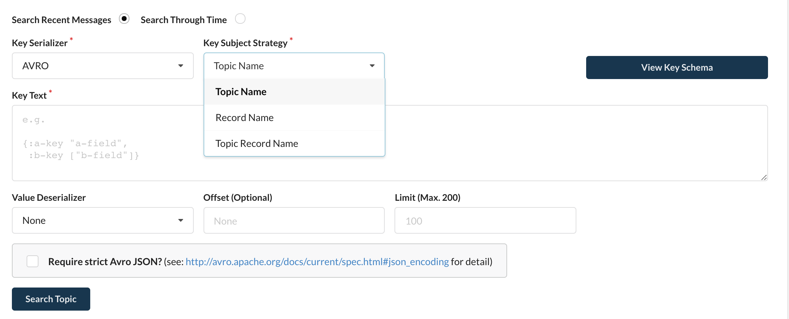

# Serdes

By default, kPow ships with the following serdes available from data inspect:

* JSON
* JSON Schema
* AVRO
* Protobuf
* String
* EDN
* Double
* Float
* Integer
* Long
* Short
* Transit / JSON
* Transit / JSON-Verbose
* Transit / Msgpack

## AVRO, JSON Schema, and Protobuf


Schema Registry serdes in kPow follow the wire format documented [here](https://docs.confluent.io/platform/current/schema-registry/serdes-develop/index.html#wire-format). 



See: [Custom Serdes](serdes.md#custom-serdes) to use kPow with Protobuf ****messages _without the Schema Registry._


kPow integrates with Confluent [Schema Registry](https://docs.confluent.io/platform/current/schema-registry/index.html) and allows for AVRO, JSON Schema and Protobuf serdes to be used in data inspect.

See [Schema Registry](https://app.gitbook.com/@operatr-io/s/kpow/~/drafts/-MN6L_-tcDmaE5R2dq-T/configuration/schema-registry) for more on how to configure Confluent Schema Registry with kPow.

Once configured, from within the data inspect UI you will now be able to select the schema and subject strategy when searching for records by key:



## Configuring Serdes

kPow offers some configuration on how serdes are presented in the UI.

#### Default Serdes

Set `DEFAULT_KEY_SERDES` or `DEFAULT_VALUE_SERDES` to specify which serdes should be selected from the dropdown by default when using data inspect. 

#### Available Serdes

To restrict the serdes available to your users set `AVAILABLE_KEY_SERDES` or `AVAILABLE_VALUE_SERDES`  
  
Eg: `AVAILABLE_VALUE_SERDES=JSON,AVRO` to only ever show JSON or AVRO serdes from within kPow's UI

## Custom Serdes


kPow works with custom `org.apache.kafka.common.serialization.Serdes<String>`


#### Why &lt;String&gt;?

kPow expects your custom serdes to provide String key/value output when deserializing messages and will interpret that String key/value output according to the serdes format you configure.

kPow will provide your custom serdes with String input when your users select a custom serdes to produce data to a topic, it is up to you how you interpret and encode that data for serialization.

Serdes with `json` or `clojure` format will have [Data Policies](../data-policies.md) applied and can be used with kJQ.

#### Setup

Provide your custom serdes on the kPow classpath \(see [How to add a Jar to the Classpath](https://stackoverflow.com/questions/15930782/call-java-jar-myfile-jar-with-additional-classpath-option)\).

Use a plain Java command similar to below to start kpow with a set classpath, note **operatr.kpow**.

`java -Xmx2G -cp /opt/kpow/lib/kpow.jar:/opt/org/custom-serdes.jar operatr.kpow`

Configure kPow with the `CUSTOM_SERDES` environment variable:

```text
# CUSTOM_SERDES accepts a comma-separated list of serdes classes

CUSTOM_SERDES=org.corp.XMLSerde,org.corp.MyCustomSerde
```

#### Configuration

Include a YAML configuration file in your jar file to configure custom serdes further \(Optional\).

**E.g.** `org.corp.XMLSerde` can be configured with `org/corp/XMLSerde.yml`

The following fields are available to configure your serdes:

* `name` - the display name to use in kPow's Data Inspect UI.
* `format` - `json`, `clojure` or `string` \(default\)
* `isKey` -  **true** for key data only, **false** for value data only, **leave unset** for both key/value data.
* `config` - a map of config values passed into the serdes `configure` method 

`Config` is converted to String/String and passed to your Serdes/configure method.   
`Config` values starting with $ are resolved as environment variables. \(e.g. $BOOTSTRAP below\)

**E.g.** Single Serdes Configuration \(json format, available to key and value fields\).

```text
name: PROTO
format: json
config:
  bootstrap: $BOOTSTRAP
  limit: 22
  display: another-value
  abc: $SOME_ENV
```

**E.g.** Multi Serdes Configuration \(json format, separate configured serdes for key and value fields\)

```text
serdes:
  - name: "PROTO 1"
    format: "json"
    isKey: true
    config:
      bootstrap: "some-value"
      limit: 22
      display: another-value
      abc: $SOME_ENV
  - name: "PROTO 2"
    format: "json"
    isKey: false
    config:
      bootstrap: "some-value"
      limit: "100"
      display: another-value
      abc: $ANOTHER_ENV
```


Serdes default to String format and are available to keys and values where no config provided


On startup you will see details logged of each custom serdes:

```text
INFO operatr.kafka.serdes – initializing custom serdes: kpow.serdes.CustomSerdesExample
INFO operatr.kafka.serdes – found kpow/serdes/CustomSerdesExample.yml
INFO operatr.kafka.serdes – serde configuration: Custom Serde!
WARN operatr.kafka.serdes – environment variable $SOME_ENV not set
INFO operatr.kafka.serdes – config 'Custom Serde!', isKey?: null, format: json, config: ("bootstrap" "limit" "display" "abc").
```

