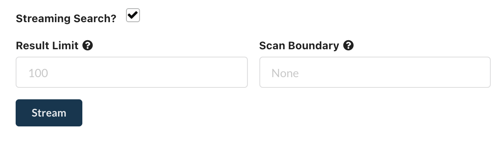

# Streaming Search

kPow Streaming Search allows you to **automatically continue queries** until:

* The number of results returned matches 'Result Limit' \(default 100\)
* The number of scanned records exceeds 'Scan Boundary'
* The query reaches the end of the topic

In function Streaming Search is precisely the same as Data Inspect, simply tick the box:

