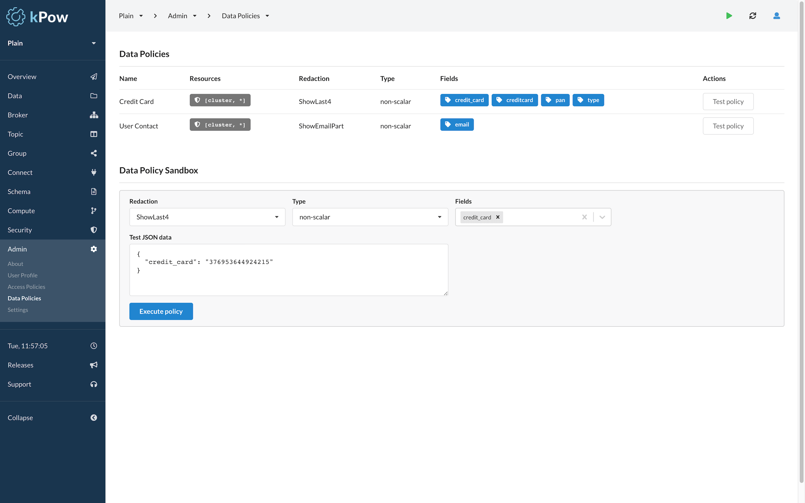

# Data Policies

kPow supports **configurable redaction of Data Inspection results** with Data Policies.

Data policies are defined in a YAML file and configured with an environment variable:

```
DATA_POLICY_CONFIGURATION_FILE=/path/to/masking/config.yml
```

Data policies are a declarative way of defining how redactions are applied to query results.

kPow supports redactions on **both the key and value** attributes of records and supports redaction of scalar types (eg: strings) or within structured data types (eg: maps, collections).

Structured data redaction currently supports AVRO, JSON, Transit, and EDN data formats.


**String serdes are removed** from Data Inspect when Data Policies are configured as they could be used to circumvent redaction.


## Exclusions

Define **exclusions:** in your Data Policies YAML file to exclude specific topics from redaction and allow them to be inspected with String serdes.

```yaml
exclusions:
  topics: ["tx_meta", "tx_metrics"]
```

## Data Policies

The YAML configuration defines policies, each policy contains:

* `name`: the unique name of the data policy
* `resources`: the resources governed by the policy
* `category`: the category for this policy
* `redaction`: the redaction function to be applied
* `type`: the type of data (either `scalar` or `non-scalar`)
* `fields`: the fields to redact for `non-scalar` data

### Example YAML


**Example: **A **Credit Card** policy that shows only the last four digits of specific fields in all topics.


```yaml
policies:
  - name: Credit Card
    category: PII
    resources:
      - [ cluster, '*' ]
    redaction: ShowLast4
    type: non-scalar
    fields: [ credit_card, creditcard, pan ]
```

### Resource

Resources are defined through a [taxonomy](https://en.wikipedia.org/wiki/Taxonomy_\(biology\)) that describes the hierarchy of objects in kPow:

```
[DOMAIN_TYPE, DOMAIN_ID, OBJECT_TYPE?, OBJECT_ID? OBJECT_RESOURCE?]
```

Where:

* `DOMAIN_TYPE`: always `cluster` for data policies
* `DOMAIN_ID`: the ID of the cluster or `*` for all clusters.
* `OBJECT_TYPE`: always `topic` for data policies
* `OBJECT_ID`: the name of the topic, wildcard not supported
* `OBJECT_RESOURCE`: either `key`, `header` or `value`

**Specifying a topic, key, or value is optional.**

### Example Resources

| Resource                                         | Effect                                         |
| ------------------------------------------------ | ---------------------------------------------- |
| `["cluster", "*"]`                               | All clusters and topics                        |
| `["cluster", "N9xnGujkR32eYxHICeaHuQ"]`          | All topics for a specific cluster              |
| `["cluster", "*", "topic", "MyTopic"]`           | Specific topic on all clusters (key and value) |
| `["cluster", "*", "topic", "MyTopic", "key"]`    | Specific topic on all clusters (key only)      |
| `["cluster", "*", "topic", "MyTopic", "value"]`  | Specific topic on all clusters (value only)    |
| `["cluster", "*", "topic", "MyTopic", "header"]` | Specific topic on all clusters (headers only)  |

###  Redaction Functions

Supported redaction functions include:

| Redaction         | Description                      | Example Data                                    | Example Result              |
| ----------------- | -------------------------------- | ----------------------------------------------- | --------------------------- |
| **Full**          | Fully redact the matched value   | John Smith                                      | \*\*\*\*\*\*\*\*\*\*\*\*    |
| **SHAHash**       | Apply a SHA512 hash to the value | John Smith                                      | ed014a19bb67a..             |
| **ShowEmailHost** | Show the email host              | [johnsmith@corp.org](mailto:johnsmith@corp.org) | \*\*\*\*\*\*\*\*\*@corp.org |
| **ShowEmailPart** | Show first character and host    | [johnsmith@corp.org](mailto:johnsmith@corp.org) | j\*\*\*\*\*\*\*\*@corp.org  |
| **ShowFirst**     | Show the first character         | John Smith                                      | J\*\*\*\*\*\*\*\*\*         |
| **ShowFirst2**    | Show the first two characters    | John Smith                                      | Jo\*\*\*\*\*\*\*\*          |
| **ShowFirst4**    | Show the first four characters   | John Smith                                      | John\*\*\*\*\*\*            |
| **ShowFirst6**    | Show the first six characters    | John Smith                                      | John S\*\*\*\*              |
| **ShowLast**      | Show the last character          | John Smith                                      | \*\*\*\*\*\*\*\*\*h         |
| **ShowLast2**     | Show the last two characters     | John Smith                                      | \*\*\*\*\*\*\*\*th          |
| **ShowLast4**     | Show the last four characters    | John Smith                                      | \*\*\*\*\*\*mith            |
| **ShowLast6**     | Show the last six characters     | John Smith                                      | \*\*\*\* Smith              |

###  Nested Redaction

kPow supports redaction of nested data structures.


**Example: **Applying the example **Credit Card** policy to a JSON message.


```javascript
{ 
  "user_details": { 
    "email_address": "a@user.com",
    "payment_options": [
      { "credit_card": "376953644924215" } 
    ] 
  } 
}
```

The data is masked accordingly when displayed in Data Inspect search results: 

```javascript
{ 
  "user_details": { 
    "email_address": "a@user.com",
    "payment_options": [
      { "credit_card": "***********4215" } 
    ] 
  } 
}
```

kPow is **conservative** when applying data policies. Given a field where the selected redaction function cannot apply, the fallback is to use the **Full** redaction policy, e.g:

```javascript
{ 
  "user_details": { 
    "email_address": "a@user.com",
    "payment_options": [
      { 
        "credit_card": {
          "pan": "376953644924215",
          "expiry": "10/10/2010"
        } 
      } 
    ] 
  } 
}
```

Applying the same Credit Card policy to this data incurs a **Full** redaction at the credit_card field as kPow does not know how to apply the configured "ShowLast4" redactor to a structured value (in this case a map with "pan" and "expiry" fields).

The result is effectively truncated:

```javascript
{ 
  "user_details": { 
    "email_address": "a@user.com",
    "payment_options": [
      { "credit_card": "***************" } 
    ] 
  } 
}
```

### Data Policy Sandbox

kPow comes with a built in **Data Policy Sandbox** to experiment with your currently configured policies or to create and test new configuration.

To access the Data Policy Sandbox navigate to **Admin -> Data Policies**



\
