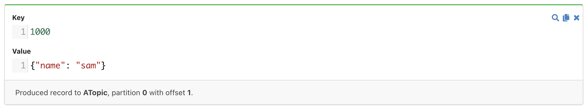
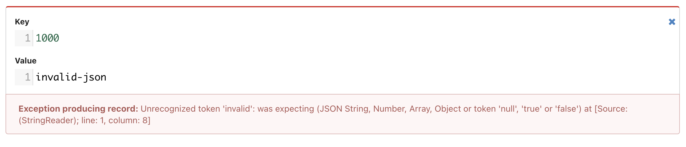
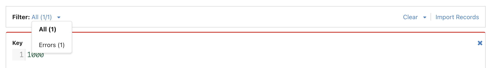

# Data Produce

## Introduction

kPow's data produce UI allows you to bulk-produce multiple records to a single topic. 

The data produce form is **idempotent**. Once a record has been produced it won't be retried.

Metadata about the record appears in the footer once it has been produced.  



If a record was unsuccessfully produced, information about the error will appear in the records footer: 



Use the toolbar to filter down to just erroring records, or clear any produced records from the form:



## Importing records

Load records from a CSV, JSON or EDN file into the data produce form by clicking the "Import Records" button on the control pane.

### CSV 

Each row in the CSV file represents a new record. Each row is a comma separated list of key and value. The escape quote char is `'` which allows for JSON data to be easily encoded.

An example CSV:

```text
"1000",'{"name": "sam"}'
"1001",'{"name": "jane"}'
```

### JSON

The format for importing JSON is a collection of objects containing `key` and `value` keys. The values for the key/value pairs must be a string.

```javascript
[{
	"key": "1000",
	"value": "{\"name\": \"sam\"}"
}]
```

### EDN

The format for importing EDN is a collection of maps containing `:key` and `:value` keys. The values for the key/value pairs must be a string

```text
[{:key "1000", :value "{\"name\": \"sam\"}"}]
```

### Data Inspect

After executing a [Data Inspect](data-inspect/) query, you can click the "Produce Results" button on the control pane. This will load the results from the query into the data produce form. 

You can also import a single record at a time by hovering over a data inspect result, clicking on the "Actions" dropdown and clicking "Produce".

## 

