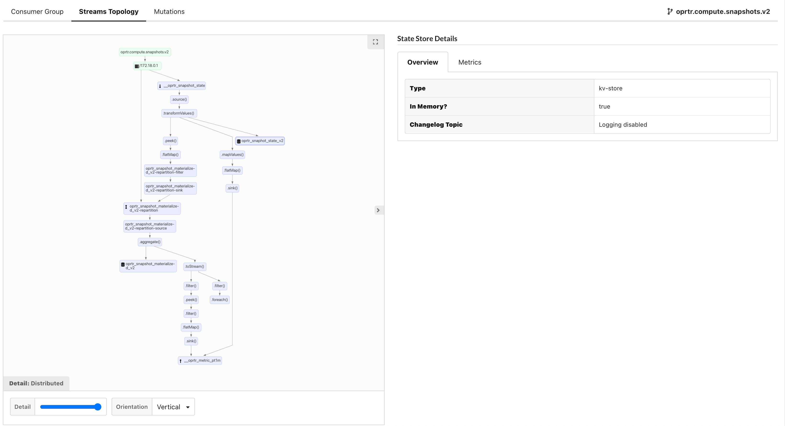

# Kafka Streams


Kafka Streams monitoring is currently in feature preview.    
If you would like early access to this feature please email: [support@operatr.io](mailto:support@operatr.io)


kPow can instrument and monitor your running [Kafka Streams](https://kafka.apache.org/documentation/streams/) applications. 

Users of kPow can monitor their Streams application with our soon-to-be open sourced agent. With kPow's Kafka Streams agent installed, your streams topology becomes visually explorable from within kPow.

After installing, you will be able to monitor your streams application and dive deep into your streams performance. RocksDB metrics, internal streams metrics and the underlying changelog topic consumption/production metrics are all exposed.

