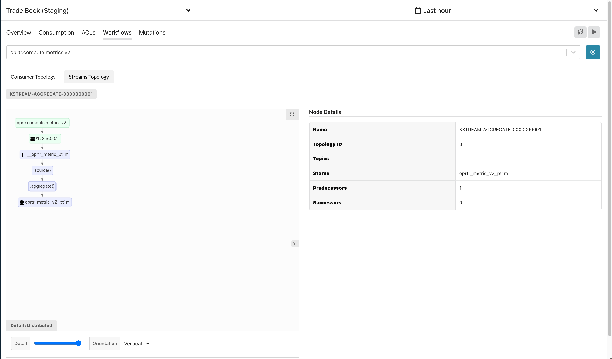

# Kafka Streams


Kafka Streams monitoring is currently in feature preview.  


## Overview

kPow can instrument and monitor your running [Kafka Streams](https://kafka.apache.org/documentation/streams/) applications. 

Users of kPow can monitor their Streams application with our [open source agent](https://github.com/operatr-io/kpow-streams-agent). 

With kPow's Kafka Streams agent installed, your streams topology becomes visually explorable from within kPow.

## Installing the agent

kPow's streams agent is accessible as a Java class that lives on your applications classpath. The easiest way to install it is adding the following dependency to your `pom.xml`

```markup
<dependency>
  <groupId>io.operatr</groupId>
  <artifactId>kpow-streams-agent</artifactId>
  <version>0.2.3</version>
  <type>bundle</type>
</dependency>
```

Once installed as a dependency in your project, you can register a Kafka Streams application against an instance of `StreamsRegistry`

```java
import io.operatr.kpow.StreamsRegistry;

// Your Kafka Streams topology
Topology topology = new Topology(); 

// Your Kafka Streams config
Properties streamsProps = new Properties();
 
// Your Kafka Streams instance
KafkaStreams streams = new KafkaStreams(topology, streamsProps); 

// kPow Producer properties for the Kafka cluster that Streams metrics will be sent (and where kPow should be installed).
Properties props = new Properties(); 

// kPow Streams Registry to periodically capture and send metrics with the Producer properties above
StreamsRegistry registry = new StreamsRegistry(props);

// Register your Kafka Streams instance with the kPow StreamsRegistry
registry.register(streams, topology); 

// Start your Kafka Streams application
streams.start();
```

Once configured, metrics will be sent periodically to kPow's internal snapshot topic

## Viewing Streams Topologies

After installing the agent, you will be able to monitor your streams application and dive deep into your streams performance. RocksDB metrics, internal streams metrics and the underlying changelog topic consumption/production metrics are all exposed.

You can view your streams topology and associated metrics from the "Consumers" page. From there navigate to the "Workflows" tab and select the consumer group name of the streams application you wish to monitor.



## Prometheus egress

If you have enabled kPow's [Prometheus integration](prometheus/), all Kafka Streams metrics collected from your running agents will be available from the endpoint `/streams/v1`

