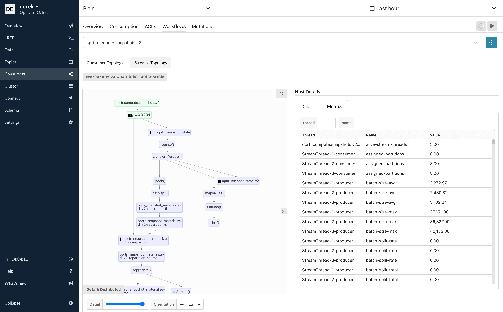

# Kafka Streams

Configure the [kPow Streams Agent](https://github.com/operatr-io/kpow-streams-agent) to unlock the following features:

* Visualise Kafka Streams topologies in the kPow Streams UI.
* Monitor Kafka Streams metrics \(e.g Stream-Thread, State Store, RocksDB, etc\).
* See summaries of Kafka Streams activity for your Kafka cluster\(s\).
* Aggregate and Expose Kafka Streams metrics via kPow [Prometheus Endpoints](https://docs.kpow.io/features/prometheus) \(for alerting, etc\).
* \(Soon\) View kPow Insights of your Kafka Streams applications \(outlier metrics, etc\).



## Installation

The kPow Stream Agent can be found on [Maven Central](https://search.maven.org/artifact/io.operatr/kpow-streams-agent).

Include the agent as a dependency in your Kafka Streams application.

```markup
<dependency>
  <groupId>io.operatr</groupId>
  <artifactId>kpow-streams-agent</artifactId>
  <version>0.2.6</version>
  <type>bundle</type>
</dependency>
```

## Integration

In your application, just before you start your KafkaStreams instance:

* Create a new [io.operatr.kpow.StreamsRegistry](https://github.com/operatr-io/kpow-streams-agent/blob/main/src/java/io/operatr/kpow/StreamsRegistry.java) instance.
* Register your KafkaStreams and Topology instances with the StreamsRegistry.

```markup
import io.operatr.kpow.StreamsRegistry;

// Your Kafka Streams topology
Topology topology = createMyTopology(); 

// Your Kafka Streams config
Properties props = new createMyStreamProperties();
 
// Your Kafka Streams instance
KafkaStreams streams = new KafkaStreams(topology, props); 

// Create a kPow StreamsRegistry
StreamsRegistry registry = new StreamsRegistry(props);

// Register your KafkaStreams and Topology instances with the StreamsRegistry
registry.register(streams, topology); 

// Start your Kafka Streams application
streams.start();
```

The StreamsRegistry is a _single-threaded process_ that performs these actions **once every minute**:

* Capture metadata about each registered Kafka Streams application.
* Produce snapshots to the kPow internal `__oprtr_snapshot_state` topic.

The StreamsRegistry **does not talk directly to kPow**. kPow reads streams data from the snapshot topic.

## Configuration

The `StreamsRegistry` `Properties` contains configuration to create the snapshot producer.

The StreamsRegistry configures its own Serdes on the snapshot producer, you do not need to set them.

Producer configuration means any of the following fields:

* bootstrap.servers
* ssl.truststore.type
* ssl.truststore.password
* ssl.truststore.location
* ssl.truststore.certificates
* ssl.trustmanager.algorithm
* ssl.secure.random.implementation
* ssl.provider
* ssl.protocol
* ssl.keystore.type
* ssl.keystore.password
* ssl.keystore.location
* ssl.keystore.key
* ssl.keystore.certificate.chain
* ssl.keymanager.algorithm
* ssl.key.password
* ssl.endpoint.identification.algorithm
* ssl.enabled.protocols
* ssl.cipher.suites
* security.protocol
* sasl.mechanism
* sasl.jaas.config
* sasl.login.callback.handler.class

For more details visit the [Producer](https://kafka.apache.org/documentation/#producerconfigs) section of the Apache Kafka documentation.

### Minimum Required ACLs

If you secure your Kafka Cluster with ACLs, the user provided in the Producer configuration must have permission to write to the internal kPow topic.

```text
./kafka-acls.sh \
  --bootstrap-server 127.0.0.1:9092 \
  --command-config client.conf \
  --add --allow-principal User:<your-producer-user> --operation Write --topic '__oprtr_snapshot_state'
```

### Produce to the Primary Cluster

When managing a single Kafka Cluster you can reuse the properties from your Kafka Streams application to create your StreamsRegisty. This is because the kPow internal topic `___oprtr_snapshot_compute` lives in the cluster that your Kafka Streams application connects to.

When managing multiple Kafka Clusters configure your StreamsRegistry to produce snapshots to the **primary** Cluster that contains the internal kPow snapshot topics. This is the first cluster in your kPow configuration.

### Single-Cluster kPow

Reuse your Kafka Streams `Properties` to create your StreamsRegistry.

```text
Properties streamsProps = new Properties();
KafkaStreams streams = new KafkaStreams(topology, streamsProps);

StreamsRegistry registry = new StreamsRegistry(streamsProps);
...
```

### Multi-Cluster kPow

Use a `Properties` with your **primary** cluster configuration to create your StreamsRegistry.

```text
Properties streamsProps = createMyStreamProperties();
KafkaStreams streams = new KafkaStreams(topology, streamsProps); 

Properties primaryProps = createMyPrimaryClusterProducerProperties();
StreamsRegistry registry = new StreamsRegistry(primaryProps);
...
```

See the [kPow Multi-Cluster Feature Guide](https://docs.kpow.io/config/multi-cluster) for more information.


**Multi-Cluster Configuration Feedback Request!**

Is the requirement to produce to the primary kPow cluster difficult for you?

Please [let us know](mailto:support@operatr.io) - we are considering the option of always writing to the same cluster as your Kafka Streams connects to and having kPow gather snapshots from each cluster.


### Register Multiple Kafka Streams Instances

You can register multiple Kafka Streams instances on the same StreamsRegistry.

```text
KafkaStreams dedupeStreams = new KafkaStreams(dedupeTopology, dedupeProps);
KafkaStreams paymentStreams = new KafkaStreams(paymentTopology, paymentProps);
registry.register(paymentStreams, paymentTopology);
registry.register(dedupeStreams, dedupeTopology);
```

## Viewing Streams Topologies

After installing the agent, you will be able to monitor your streams application and dive deep into your streams performance. RocksDB metrics, internal streams metrics and the underlying changelog topic consumption/production metrics are all exposed.

You can view your streams topology and associated metrics from the "Consumers" page. From there navigate to the "Workflows" tab and select the consumer group name of the streams application you wish to monitor.


## Prometheus Egress

If you have enabled kPow's [Prometheus integration](prometheus/), all Kafka Streams metrics collected from your running agents will be available from the endpoint `/streams/v1`

