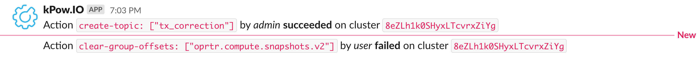

# Slack Integration

kPow can send [**Audit Log**](data-governance.md) records to your Slack, all you need to do is configure a webhook.

## Configuration

1. Add an [**Incoming Webhooks**](https://slack.com/apps/A0F7XDUAZ-incoming-webhooks) integration to your Slack.
2. Select a channel and click the "Add Incoming WebHooks integration" button
3. Copy the "Webhook URL" value from the "Setup Instructions" form
4. Set the environment variable **`SLACK_WEBHOOK_URL`** with the value from the previous step.
5. Restart kPow, now audit items are posted to your slack!

