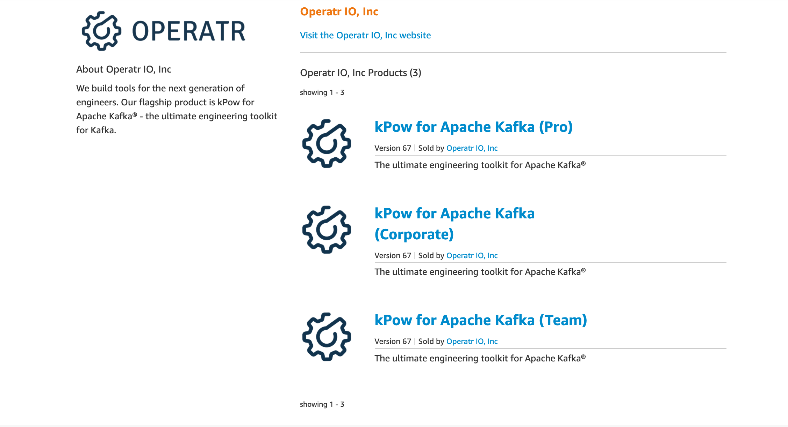
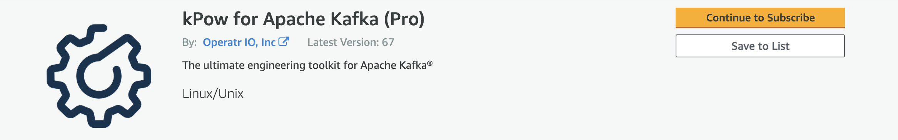
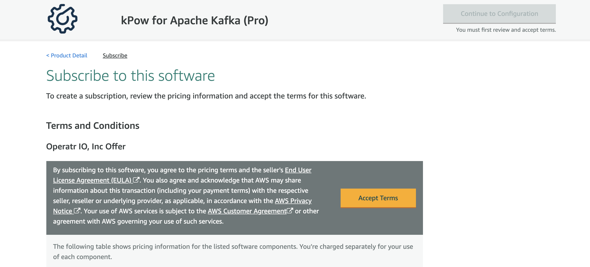
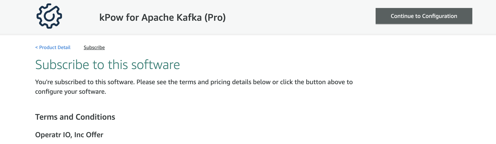
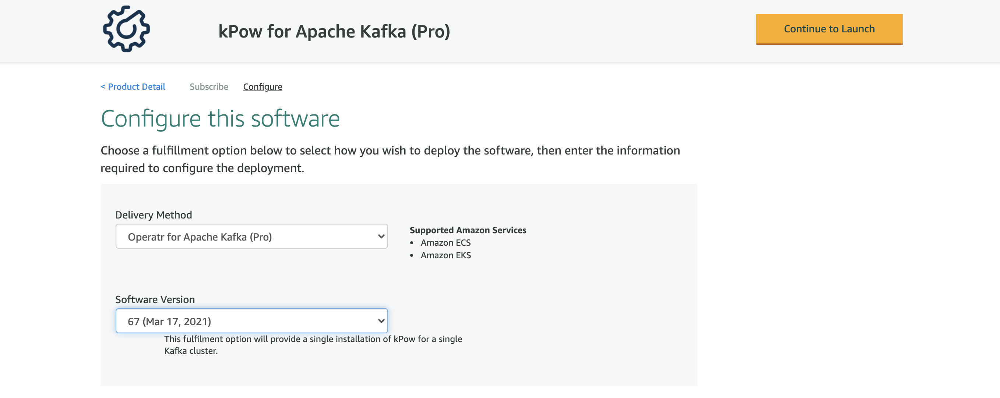
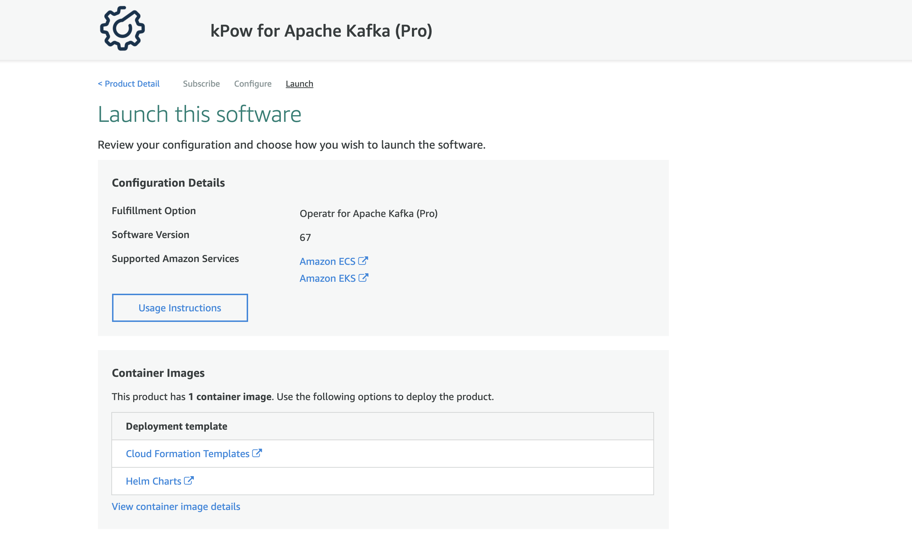
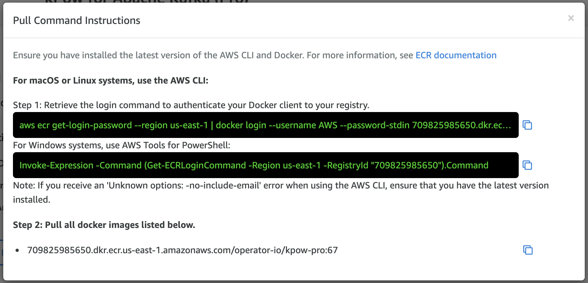

# AWS Marketplace

kPow is available to [purchase via the AWS Marketplace](https://aws.amazon.com/marketplace/seller-profile?id=ab356f1d-3394-4523-b5d4-b339e3cca9e0).

kPow works beautifully with Amazon MSK and runs perfectly in ECS / Fargate / EKS.

Subscribe to kPow on the AWS Marketplace and get an **automatically licensed** container billed to your AWS account monthly with the freedom to update to the latest kPow whenever you like.


See our [**AWS Marketplace Seller Profile**](https://aws.amazon.com/marketplace/seller-profile?id=ab356f1d-3394-4523-b5d4-b339e3cca9e0) to see every option for purchasing kPow on AWS.


## The Basics

When you subscribe to a [kPow product on the AWS Marketplace](https://aws.amazon.com/marketplace/seller-profile?id=ab356f1d-3394-4523-b5d4-b339e3cca9e0) you gain access to a kPow AWS Marketplace container that is functionally the same as the kPow container available via [Dockerhub](https://hub.docker.com/r/operatr/kpow).

The AWS Marketplace container makes a single call to [AWSMarketplaceMetering/registerUsage](https://docs.aws.amazon.com/marketplacemetering/latest/APIReference/API_RegisterUsage.html) when kPow starts, allowing AWS to check your subscription and meter your usage if you have chosen the hourly-metered product.

The kPow AWS Marketplace container is **automatically licensed** to the AWS account that subscribes to a product and that account is billed monthly for the subscription. You **do not need to arrange a separate license with us directly** if you subscribe to a kPow product on the AWS Marketplace. It just works.

We update each kPow product on the AWS Marketplace with every major release, simply check your subscription details to find the latest container and update whenever you like.

## The Products

There are three kPow products on the AWS Marketplace.


Each kPow product is functionally the same, only the billing and licensing change.


### [kPow \(Pro\) - Hourly Metered](https://aws.amazon.com/marketplace/pp/B084BTWJHD?ref_=srh_res_product_title)

Subscribe to [kPow \(Pro\)](https://aws.amazon.com/marketplace/pp/B084BTWJHD?ref_=srh_res_product_title) to gain access to a Marketplace kPow container that can connect to a single Kafka Cluster and associated Schema Registries and Kafka Connect clusters.

Start as many instances of kPow as you need from the provided container. Usage of each instance is metered and billed by the hour at the kPow metered rate of **$0.16c/hr**. 

kPow \(Pro\) allows you to pay only for the kPow hours you use with no ongoing commitment.

### [kPow \(Team\) - Monthly Subscription](https://aws.amazon.com/marketplace/pp/B08KFQGJSZ?ref_=srh_res_product_title)

Subscribe to [kPow \(Team\) ](https://aws.amazon.com/marketplace/pp/B08KFQGJSZ?ref_=srh_res_product_title)to gain access to a Marketplace kPow container that can connect to up to six Kafka Clusters and their associated Schema Registries and Kafka Connect clusters at once.

kPow Team comes with a license to use the kPow container with at most six Kafka clusters, regardless of how many separate instances of kPow you start. Usage is not metered and the subscriber AWS account is billed monthly at the team subscription price of **$540/mo**.

### kPow \(Corporate\) - Monthly Subscription

This product is the same as kPow \(Team\) but licensed for up to twelve Kafka Clusters and their associated Schema Registries and Kafka Connect clusters.

Usage is not metered and the subscriber AWS account is billed monthly at the corporate subscription price of **$940/mo.**

## **Technical Requirements**

The kPow Marketplace container makes a call to [AWSMarketplaceMetering/registerUsage](https://docs.aws.amazon.com/marketplacemetering/latest/APIReference/API_RegisterUsage.html) when kPow starts. This is required by AWS so they may check your marketplace subscription and meter your usage if you have chose to use kPow \(Pro\). This causes the following requirements:

#### ECS / Fargate / EKS Only

The AWS Marketplace container must be run in an ECS task \(including Fargate\) or an EKS pod.

#### IAM Roles

The AWS Marketplace container must run with an IAM role with permissions to call the AWSMarketplaceMetering/registerUsage API. Details for EKS and ECS follow.

## Request a BYOL License

Some customers pay for kPow via the AWS Marketplace but find the requirement to configure IAM Roles and to run in EKS / ECS / Fargate prohibitive or impossible. 

We offer the Team and Corporate monthly subscription licenses for this exact use-case. 

If you chose a Team or Corporate Subscription but do not want to implement IAM Roles for your kPow containers then contact [**support@operatr.io**](mailto:support@operatr.io) ****and once we have verified your subscription we will provide you a **Bring Your Own License** \(BYOL\) license for the Marketplace container that averts the call to registerUsage and allows you to run kPow without configuring IAM roles and in environments other than EKS / ECS / Fargate.

With this option AWS acts solely as a billing agent for your usage of kPow.

## Start a Subscription to kPow on the AWS Marketplace

Getting started is easy, just choose a product from our [Marketplace Seller Profile](https://aws.amazon.com/marketplace/seller-profile?id=ab356f1d-3394-4523-b5d4-b339e3cca9e0):



Selected a product and click **'Continue to Subscribe'**:



Review and accept the Operatr.IO EULA:



Once your subscription is activated, click **'Continue to Configuration':**



Choose **'Operatr for Apache Kafka \(Pro\)'** as the delivery method, and the latest version available.

Click **'Continue to Launch':**



Click **'View container image details'** at the bottom of the launch page:



See **'Pull Command Instructions'** giving you access to the kPow container for your subscription.



Pull the docker image listed at the bottom of the instruction into your own docker repository, or simply use it directly in a ECS / Fargate / EKS to launch kPow instances with the correct IAM permissions.


Check your subscription regularly for new releases of kPow and update accordingly!


## Required IAM Role

The kPow Marketplace container must be run with an IAM role with the correct policy attached.

The **AWSMarketplaceMeteringRegisterUsage** policy allows the container to check your subscription and meter your usage if you are using kPow \(Pro\).

```text
{
  "Version": "2012-10-17",
  "Statement": [
    {
      "Action": [
        "aws-marketplace:RegisterUsage"
      ],
      "Effect": "Allow",
      "Resource": "*"
    }
  ]
}
```

## **Deploying kPow to ECS**

Use the Docker container obtained from your marketplace subscription to configure an ECS task with the correct IAM Role and Policy, then simply launch that task in either Fargate or EC2.

See our [**Quick Start CloudFormation templates**](https://github.com/operatr-io/infra/tree/master/aws-marketplace) for an example of launching kPow in ECS/Fargate with the IAM Role and Policy automatically created and attached to the task.

## Deploying kPow to EKS

To deploy the Dockerhub kPow container to EKS see our [**Quick Start Helm Chart for kPow**](%20https://github.com/operatr-io/infra/tree/master/kubernetes/helm).

Deploying the Marketplace kPow container to EKS is slightly more complicated due to the requirement to run the container with the correct IAM Role and Policy - this means configuring a Service Account that has the correct IAM role. Fine grained IAM roles for Service Accounts are [available in EKS Clusters v1.14+.](https://docs.aws.amazon.com/eks/latest/userguide/iam-roles-for-service-accounts.html)


Remember: You can avoid these requirements with a Team or Corporate BYOL license.


### Configure your EKS Cluster and Deploy kPow

The following steps guide you through a simple installation of kPow in EKS. 

See [this article](https://aws.amazon.com/blogs/opensource/introducing-fine-grained-iam-roles-service-accounts/) for further background reading on Fine Grained IAM Roles for Service Accounts.

#### Update your KubeConfig

```text
$ aws eks --region [EKS-REGION] update-kubeconfig --name [EKS-CLUSTER-NAME]

> Added new context arn:aws:eks:us-east-1:[YOUR-ACCOUNT-ID]:cluster/[EKS-CLUSTER-NAME] to /Users/you/.kube/config
```

#### Test you Cluster Connectivity

```text
$ kubectl get svc

> NAME TYPE CLUSTER-IP EXTERNAL-IP PORT(S) AG
> kubernetes ClusterIP 10.100.0.1 443/TCP 3h34m
```

#### Enable IAM Roles for Service Accounts

```text
$ aws eks describe-cluster --region [EKS-REGION] --name [EKS-CLUSTER-NAME] --query "cluster.identity.oidc.issuer" --output text

> https://oidc.eks.us-east-1.amazonaws.com/id/086F0892931ED09F5D966F5353D1A18F
```

#### **Create an OIDC identity provider in the IAM console**


Use the output from the previous step to [**Create an IAM OIDC provider for your Cluster**](https://docs.aws.amazon.com/eks/latest/userguide/enable-iam-roles-for-service-accounts.html).


#### Create the Service Account IAM Role


Follow the instructions to [**Create a Service Account IAM Policy and Role**](https://docs.aws.amazon.com/eks/latest/userguide/create-service-account-iam-policy-and-role.html)\*\*\*\*


The attached policy should be **AWSMarketplaceMeteringRegisterUsage:**

```text
{
  "Version": "2012-10-17",
  "Statement": [
    {
      "Action": [
        "aws-marketplace:RegisterUsage"
      ],
      "Effect": "Allow",
      "Resource": "*"
    }
  ]
}
```

The trust policy of your created role should look similar to:

```text
{
  "Version": "2012-10-17",
  "Statement": [
    {
      "Effect": "Allow",
      "Principal": {
        "Federated": "arn:aws:iam::[YOUR-ACCOUNT-ID]:oidc-provider/[ISSUER-HOSTPATH]"
      },
      "Action": "sts:AssumeRoleWithWebIdentity",
      "Condition": {
        "StringEquals": {
          "oidc.eks.us-east-1.amazonaws.com/id/086F0892931ED09F5D966F5353D1A18F:sub": "system:serviceaccount:default:kpow-service"
        }
      }
    }
  ]
}
```

#### Create a Service Account YAML

Using the ARN of the IAM Role:

```text
apiVersion: v1
kind: ServiceAccount
metadata:
  name: kpow-service
  namespace: default
  annotations:
    eks.amazonaws.com/role-arn: arn:aws:iam::[YOUR-ACCOUNT-ID]:role/[YOUR-EKS-REGISTER-USAGE-ROLE]
```

#### Make the Service Account available

```text
$ kubectl apply -f kpow-service-account.yaml

> serviceaccount/oprtr-service created

$ kubectl describe serviceaccounts

> Name:                oprtr-service
> Namespace:           default
> Labels:              
> Annotations:         eks.amazonaws.com/role-arn: arn:aws:iam::[YOUR-ACCOUNT]:role/[YOUR-ROLE]
>                      kubectl.kubernetes.io/last-applied-configuration:
>                        {"apiVersion":"v1","kind":"ServiceAccount","metadata":{"annotations":{"eks.amazonaws.com/role-arn":"arn:aws:iam::[YOUR-ACCOUNT]:role/OP-EKS-...
> Image pull secrets:  
> Mountable secrets:   oprtr-service-token-xkmwt
> Tokens:              oprtr-service-token-xkmwt
> Events:              
```

#### Create a kPow Deployment YAML

Using the Service Account created above:

```text
apiVersion: apps/v1
kind: Deployment
metadata:
  name: kpow-io
  namespace: default
spec:
  replicas: 1
  selector:
    matchLabels:
      app: kpow-io
  template:
    metadata:
      labels:
        app: kpow-io
    spec:
      serviceAccountName: kpow-service
      containers:
        - name: kpow-io
          image: [AWS-MARKETPLACE-CONTAINER-URL]
          ports:
            - containerPort: 3000
          resources:
            limits:
              cpu: 1
              memory: 2Gi
            requests:
              cpu: 1
              memory: 2Gi
          env:
            - name: AWS_REGION
              value: "us-east-1"
            - name: BOOTSTRAP
              value: "YOUR BOOTSTRAP URL"
            - name: FURTHER_CONFIGURATION
              value: "YOUR FURTHER CONFIGURATION"
      securityContext:
        fsGroup: 1337
```

#### Deploy kPow to EKS!

```text
$ kubectl create -f kpow-container.yaml

> deployment.apps/kpow-io created

$ kubectl describe pods

> Name:           kpow-io-7ff67bf946-n4hm2
> Namespace:      default

> kubectl logs kpow-io-7ff67bf946-n4hm2

```

You have now deployed kPow to EKS using a Service Account with an IAM Role and attached AWSMarketplaceMeteringRegisterUsage policy. Congrats!

## Get Help!

For assistance installing and configuring kPow on the AWS Marketplace contact **support@operatr.io**

