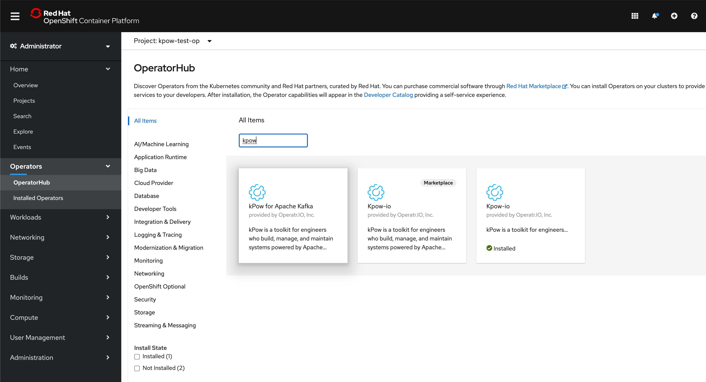
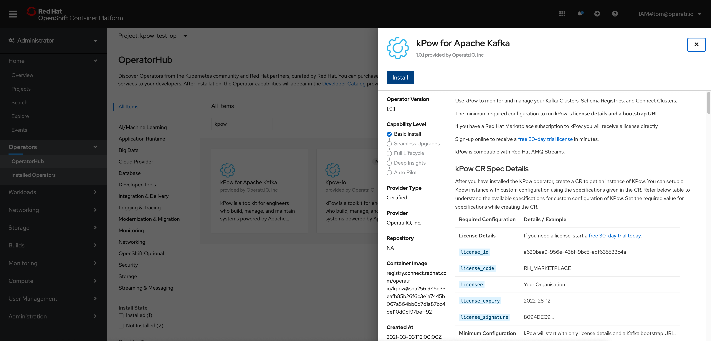
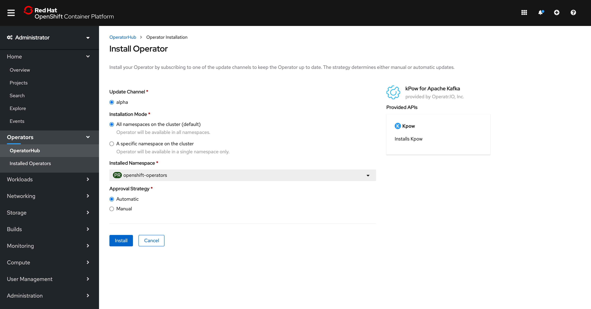
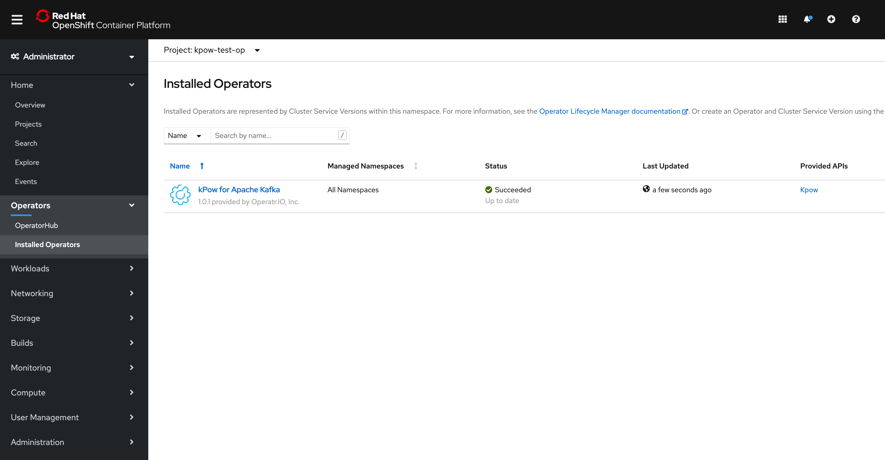

# OpenShift

## Basics


kPow is compatible with **Red Hat AMQ Streams**


kPow is available as an Operator on the Red Hat Marketplace and OperatorHub.

Installed in one click and requiring little configuration, kPow will manage and monitor your Kafka resources \(including Clusters, Schema Registries, and Connect Installations\) security and safely with all data stored in local topics within your cluster.

## Prerequisites

kPow has two prerequisites:

#### License

kPow requires a license to operate, [get a 30-day free trial license in minutes](https://kpow.io/try).

If you purchase kPow on the Red Hat Marketplace a license will automatically be provisioned for you.

#### Kafka Cluster

kPow requires at least one Kafka Cluster bootstrap URL in order to start correctly

All configuration beyond License and Kafka bootstrap URL is optional.

## OperatorHub

Select the `OperatorHub` from the `Operators` menu and search for **kPow.**

Select **kPow** and click **Install**

Select the install options. kPow instances are stateless, all data is stored in your Kafka Cluster, and we are committed to seamless upgrades - we recommend you select Automatic approval strategy.

kPow is now available as an installed Operator in your OpenShift cluster

## Red Hat Marketplace


Register your OpenShift cluster to purchase kPow on the Red Hat Marketplace


Installation of kPow from the Red Hat Marketplace requires the OpenShift cluster to be registered to the Marketplace Portal, including the roll out of the PullSecret in your cluster. 

Failure to register will result in an image pull authentication failure with the Red Hat registry.

