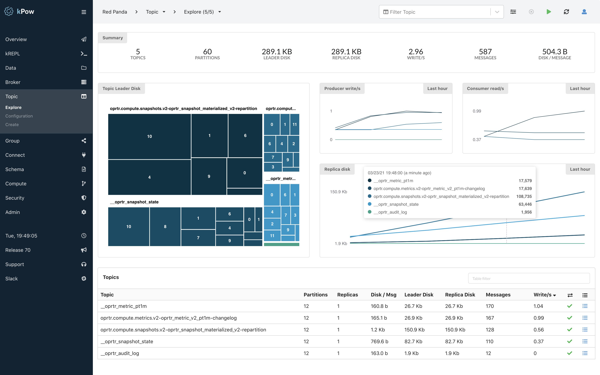

# OpenShift


kPow is available to purchase on the [**Red Hat Marketplace**](https://marketplace.redhat.com/en-us/products/operatr-for-apache-kafka)**.**


## Basics


kPow is compatible with **Red Hat AMQ Streams**


kPow is available as an Operator on the Red Hat Marketplace and OperatorHub.

Installed in one click and requiring little configuration, kPow will manage and monitor your Kafka resources (including Clusters, Schema Registries, and Connect Installations) security and safely with all data stored in local topics within your cluster.

## Prerequisites

kPow has two prerequisites:

#### License

kPow requires a license to operate, [get a 30-day free trial license in minutes](https://kpow.io/try).

If you purchase kPow on the Red Hat Marketplace a license will automatically be provisioned for you.

#### Kafka Cluster

kPow requires at least one Kafka Cluster bootstrap URL in order to start correctly

All configuration beyond License and Kafka bootstrap URL is optional.

## OperatorHub

### Install the kPow Operator

Select the `OperatorHub` from the `Operators` menu and search for **kPow.**

Select **kPow** and click **Install**

Select the install options. kPow instances are stateless, all data is stored in your Kafka Cluster, and we are committed to seamless upgrades - we recommend you select Automatic approval strategy.

kPow is now available as an installed Operator in your OpenShift cluster!

### Launch a kPow Instance

Select the kPow for Apache Kafka Operator

#### Obtain a kPow License

kPow requires a license to run. You can start a 30-day free trial by following the link in the Operator summary (above). A trial license will be emailed to you within minutes of signing up.

#### Create a kPow Instance

kPow is configured almost entirely via environment variables.

There are some small number of optional configuration files (yaml and keystores) that you may need to configure depending on your requirements and/or environment. In each case you will provide those files to the kPow instance via secrets. Details of creating secrets and configuring files are in the Operator summary.

When you have a license and the bootstrap of your Kafka Cluster, click **Create Instance **then **YAML View**

#### **Configure the kPow Instance**

The minimum configuration required to launch a kPow is **licence** and **bootstrap** details.

See the kPow Operator summary for details on advanced configuration options and secrets.

After setting the YAML options, click **Create**

#### **View Installed Operators**

Validate that the kPow instance is deployed successfully:

**Operators > Installed Operators > kPow for Apache Kafka > Kpow**

#### View the kPow UI

Select the installed kPow instance from the list of kPows

Select **Resources / kPow**

Click the **Location** URL to navigate to kPow and start using the product

## Get Help!

If you need any assistance installing or configuring kPow on OpenShift contact **support@operatr.io**

## Red Hat Marketplace


Register your OpenShift cluster to purchase kPow on the Red Hat Marketplace


Installation of kPow from the Red Hat Marketplace requires the OpenShift cluster to be registered to the Marketplace Portal, including the roll out of the PullSecret in your cluster. 

Failure to register will result in an image pull authentication failure with the Red Hat registry.

