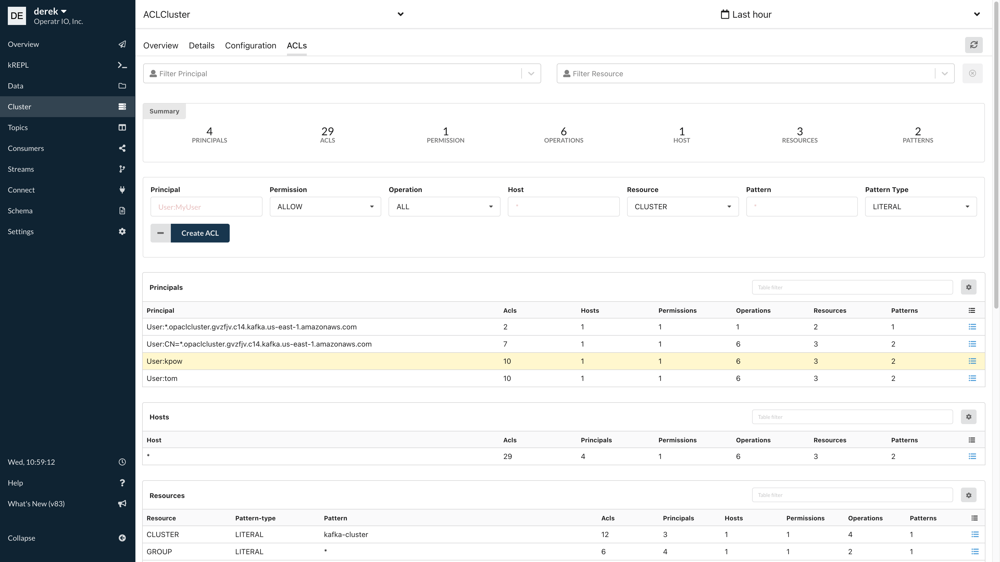
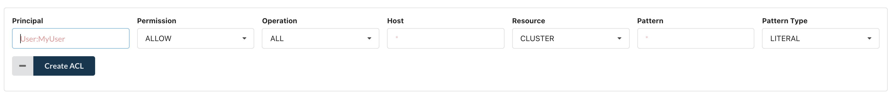

# ACLs

kPow provides a complete management interface to Kafka ACLs.

All ACL actions \(create, clone, delete\) are recorded in the kPow Audit Log.

## Prerequisites

* You have setup the correct [access control permissions](../authorization/overview.md) in kPow to allow `ACL_EDIT` 
* You have setup the [correct ACLs](../installation/minimum-acl-permissions.md) if you have enabled ACLs in your Kafka Cluster

## Managing ACLs

An overview about your cluster's ACLs can be found in the navigation menu under the **Security** menu item.

Within the security page, there are four tables for ACL management: 

* Principals
* Hosts
* Resources
* Controls

### ACL actions

Clicking the actions button on any row in an ACL table will give you a popup of available actions:

* **Clone ACL**: this allows you to clone a control/resource/host/principal. For example, you could clone all ACLs that relate to principal **user:derek** to another principal such as **user:tom**.
* **Delete ACL**: this allows you to delete ACLs at a control/resource/host/principal level. 

### Creating ACLs

The first UI element of the **Security** page allows you to create new ACLs. Simply fill out the ACL form fields and click **Create ACL**

## Group + Topic ACL management

From within the **Topic Explore** or **Group explore** page, ACL management is available.

Filtering the explore page by topic will allow you to see all ACLs that apply to the topic under the **Topic ACLs** table. Each row in the table has various actions such as **Clone ACL** and **Delete ACL**. You can also create new ACLs for this topic by clicking the **Create ACL** button.

The same functionality is available from the **Group explore** page for managing group ACLs.

