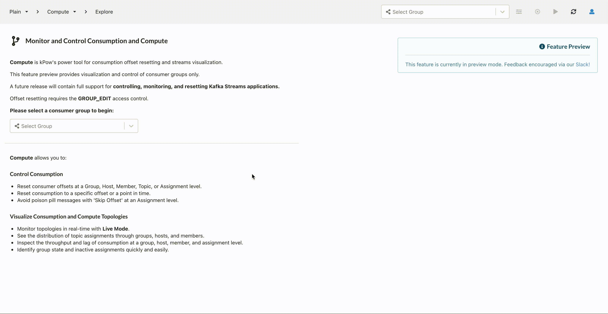
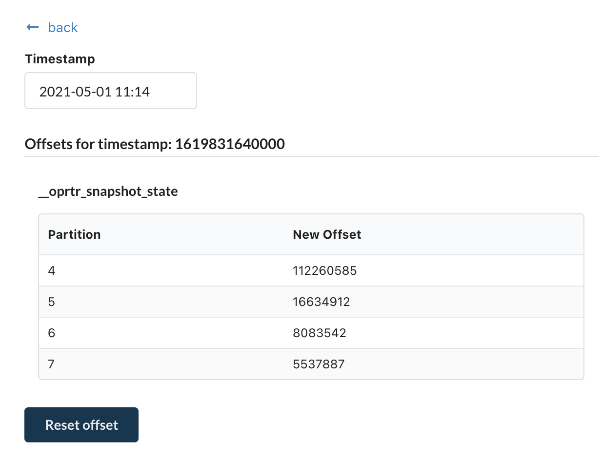

# Groups

## Prerequisites

* You have setup the correct [access control permissions](../authorization/overview.md) in kPow to allow `GROUP_EDIT` 
* You have setup the [correct ACLs](../installation/minimum-acl-permissions.md) if you have enabled ACLs in your Kafka Cluster

## Managing Offsets

### Overview

Within kPow you can change consumer group offsets from any dimension:

* Whole group assignments
* Host-level assignments
* Topic-level assignments  
* Partition-level assignment

Offsets can be reset in multiple ways:

* By offset value
* To the earliest offset
* By time
* By skipping an offset \(eg, incrementing the current offset\)

### Offset actions

Group offset management can be found in the navigation menu under the **Compute** menu item. 

Select the consumer group you would like to manage from the dropdown, and you will see the consumer group topology. 

All offset management actions are available when clicking on a node:

Once you have selected a node, the available group offset actions can be found under the **Mutations** section on the right-hand pane.

### Scheduling a mutation

All group offset actions are scheduled, and will be invoked once all **prerequisites** have been met. For group offsets, the prerequisite is that the consumer group's state must be **EMPTY**. That is, you will have to manually scale down all instances of the consumer group to alter their offsets. This is because group actions cannot be performed on a running consumer group.

By default, kPow will try to run the mutation for up to 15 minutes after it has been scheduled. You can cancel the mutation or view its current status by clicking on the **Mutations** tab.

