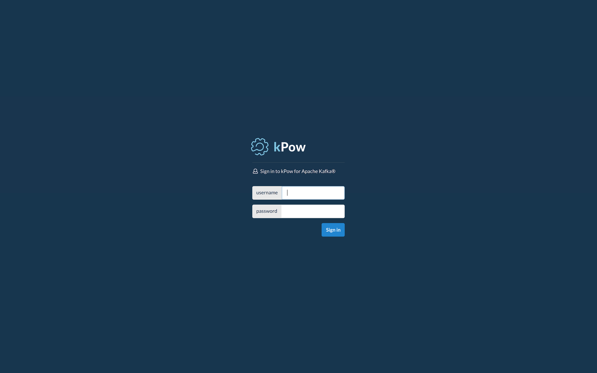

# LdapLoginModule

Configure kPow to read authentication and role information from LDAP.


**In Depth:** For specifics on JAAS / LDAP configuration see the [**Jetty LdapLoginModule**](https://www.eclipse.org/jetty/documentation/current/jaas-support.html) ****docs.


## Form or Basic Authentication?

kPow supports both form-based and basic authentication.

**Form authentication is the default.** To basic authentication, set the environment variable:

```text
JETTY_AUTH_METHOD=basic
```

## Configuration

To enable LdapLoginModule authentication you must:

* Create a JAAS configuration file
* Set the **`AUTH_PROVIDER_TYPE=jetty`** environment variable.
* Start the JAR or Docker container with `-Djava.security.auth.login.config=/path/to/jaas.conf`

### JAAS Configuration

Create a JAAS LDAP configuration file \(the **kpow** realm is very important\).

```text
kpow {
  org.eclipse.jetty.jaas.spi.LdapLoginModule required
  useLdaps="false"
  contextFactory="com.sun.jndi.ldap.LdapCtxFactory"
  hostname="your.ldap.host"
  port="your.ldap.port"
  bindDn="CN=YourCN,OU=YourOU,DC=YourDC,DC=com"
  bindPassword="*******"
  authenticationMethod="simple"
  forceBindingLogin="true"
  userBaseDn="OU=UserOU,OU=UserOU,DC=UserDC,DC=UserDC"
  userRdnAttribute="UserRDN"
  userIdAttribute="UserID"
  userPasswordAttribute="UserPW"
  userObjectClass="user"
  roleBaseDn="OU=RoleOU,DC=RoleDC,DC=RoleDC"
  roleNameAttribute="cn"
  roleMemberAttribute="member"
  roleObjectClass="group";
};
```

### Environment Configuration

To activate Jetty JAAS authentication set the environment variable **`AUTH_PROVIDER_TYPE=jetty`**

### JAR Startup

Specify the JAAS config file by setting the following system property when starting the JAR:

  `-Djava.security.auth.login.config=/path/to/jaas.conf` 


**Note:** System properties must come after **java** but before **-jar**.


```bash
AUTH_PROVIDER_TYPE=jetty \
<... more env vars ...> \
java -Djava.security.auth.login.config=/opt/kpow/jaas.conf -jar /opt/kpow/latest.jar 
```

### Docker Container Startup


**Note:** The JVM provides an environment variable called `JAVA_TOOL_OPTIONS` that can be used in place of system properties. We use this the thread the JAAS config to Docker.


Set the env var `JAVA_TOOL_OPTIONS=-Djava.security.auth.login.config=/path/to/jaas.conf`

When starting the docker container you will see logging output similar to:

```bash
Picked up JAVA_TOOL_OPTIONS: -Djava.security.auth.login.config=/path/to/jaas.conf
```

## User Experience

When configured your users will be prompted to authenticate on each new browser session.



