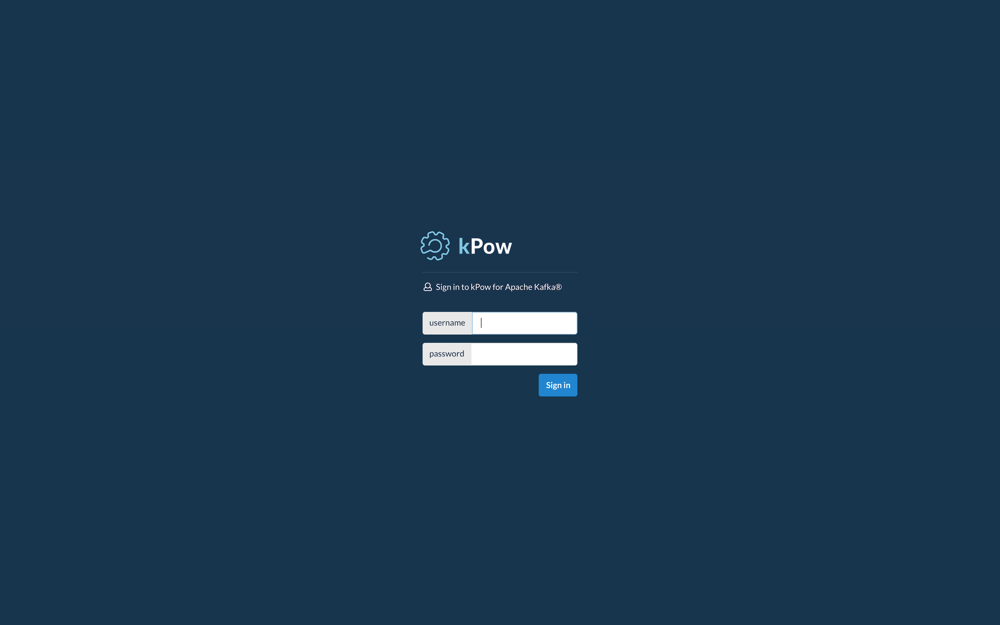

# PropertyFileLoginModule

Configure kPow to read authentication and role information from a property file.


**For More:** Read the **Jetty PropertyFileLoginModule** docs.


## Form or Basic Authentication?

kPow supports both form and basic \(browser default\) authentication.

**Form authentication is the default.** To basic authentication, set the environment variable:

```text
JETTY_AUTH_METHOD=basic
```

## Configuration

* Create a JAAS configuration file \(the **kpow** realm is very important\).

```text
kpow {
        org.eclipse.jetty.jaas.spi.PropertyFileLoginModule required
        file="/opt/kpow/user.props";
      };
```

* Create a users property file **at the path configured in your JAAS config**.

```text
# This file defines users passwords and roles for a HashUserRealm
#
# The format is
#  <username>: <password>[,<rolename> ...]
#
# Passwords may be clear text, obfuscated or checksummed.  The class
# org.eclipse.jetty.util.security.Password should be used to generate obfuscated
# passwords or password checksums
#
# If DIGEST Authentication is used, the password must be in a recoverable
# format, either plain text or OBF:.
#
# Credentials are jetty/jetty, admin/admin, other/other, plain/plain,
#                 user/password, and digest/digest
#
jetty: MD5:164c88b302622e17050af52c89945d44,kafka-users
admin: CRYPT:adpexzg3FUZAk,kafka-admins
other: OBF:1xmk1w261u9r1w1c1xmq,kafka-admins,kafka-users
plain: plain,content-administrators
user: password,kafka-users
# This entry is for digest auth.  The credential is a MD5 hash of
# username:realmname:password
digest: MD5:6e120743ad67abfbc385bc2bb754e297,kafka-users
```

* Set the environment variable `AUTH_PROVIDER_TYPE=jetty`
* Specify your JAAS config file with `-Djava.security.auth.login.config=/path/to/jaas.conf`

```bash
AUTH_PROVIDER_TYPE=jetty <more env vars> java -Djava.security.auth.login.config=/opt/kpow/jaas.conf -jar /opt/kpow/latest.jar 
```

* Start kPow and your users will be prompted to authenticate.



