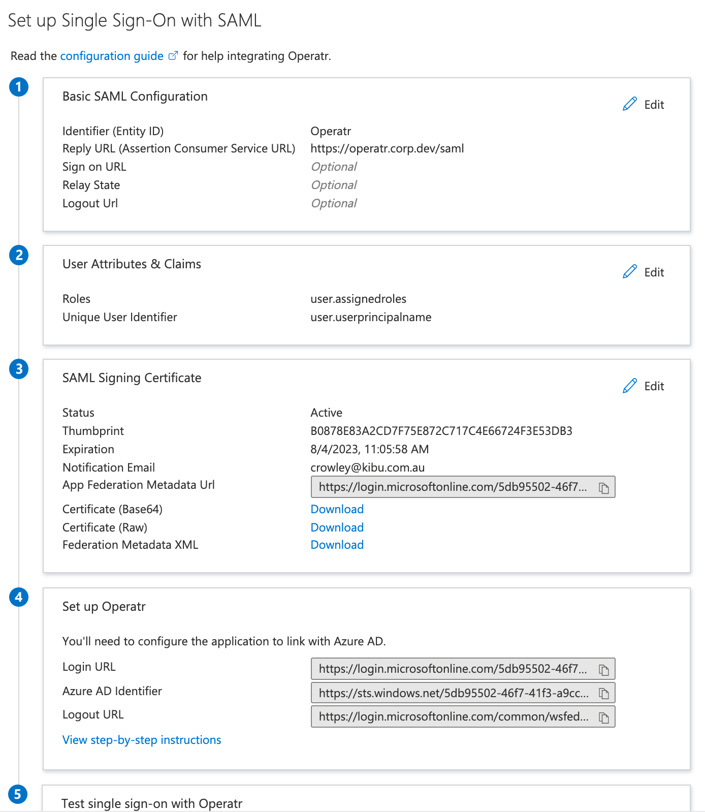
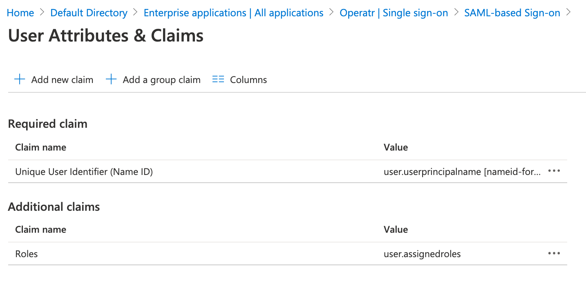

# Azure AD integration

## User Authentication

### Configuring Azure AD

* Open the Azure Portal and select the directory to use for single sign-on.
* Navigate to **Enterprise Applications &gt; Add an Application &gt; Non-Gallery Application**.
* Pick a name for your application and click the **Add** button.
* You should now be in the dashboard for the kPow application.
* Navigate to **Single Sign-On**, select **SAML** as the single sign-on method.

Configure as follows:

#### Basic SAML Configuration

* **Identifier \(Entity ID\)**: set this to `kPow`
* **Reply URL \(Assertion Consumer Service URL\)**: Your kPow instance SAML URL, e.g:

  ```text
  https://kpow.corp.com/saml
  ```

* Leave the other fields blank

#### SAML Signing Certificate

Download the **Federation Metadata XML** file and optionally **Certificate \(Raw\)**. Save these for later.



### Integrate kPow and Azure AD SSO

Set the following environment variables and start kPow.

* `AUTH_PROVIDER_TYPE=saml`
* `SAML_RELYING_PARTY_IDENTIFIER=` The **Identifier \(Entity ID\)**
* `SAML_ACS_URL=` The **Reply URL \(Assertion Consumer Service URL\)**
* `SAML_METADATA_FILE=` The path to the **Federation Metadata XML** file, e.g.

  ```text
  /var/saml/azure-metadata.xml
  ```

* `SAML_CERT=`\(optional\) The path to the **Certificate \(Raw\)** `.pem` file, e.g.

  ```text
  /var/certs/azure-saml-cert.cer
  ```

kPow will now authenticate users with Azure AD.

## User Authorization

See the guide to [Role Based Access Control](https://support.operatr.io/hc/en-us/articles/900002019823) for full configuration details.

### Integrate Azure AD and kPow RBAC

Follow this [guide](https://docs.microsoft.com/en-us/azure/active-directory/develop/active-directory-enterprise-app-role-management) to populate `user.assignedroles`, then setup attribute claims within your Enterprise Application configuration like so: \(note the `Roles`additional claim\).



**Note:** The default role \(`User`\) does not get passed as an assigned role in the SAMLResponse.

