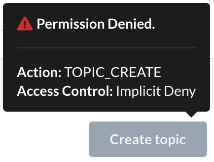

# Overview

kPow supports two methods of controlling user access to **actions**.

* \*\*\*\*[**Simple Access Control**](simple-access-control.md) ****creates global access controls from environment variable config
* \*\*\*\*[**Role Based Access Control**](role-based-access-control.md) ****integrates with [**User Authentication**](../user-authentication/overview.md) and respects role based controls

## User Actions

The following actions are supported by both methods of access control.

| Action | Control \(when TRUE\) |
| :--- | :--- |
| **TOPIC\_INSPECT** | Allow users to read topic key and value data |
| **TOPIC\_PRODUCE** | Allow users to write new messages to topics |
| **TOPIC\_CREATE** | Allow users to create new topics |
| **TOPIC\_EDIT** | Allow users to edit topic configuration |
| **TOPIC\_DELETE** | Allow users to delete topics |
| **GROUP\_EDIT** | Allow users to delete consumer groups and reset consumer offsets |
| **BROKER\_EDIT** | Allow users to edit broker configuration |
| **SCHEMA\_CREATE** | Allow users to create new schemas and subjects |
| **SCHEMA\_EDIT** | Allow users to edit schemas and subjects |
| **CONNECT\_CREATE** | Allow users to create new connectors |
| **CONNECT\_EDIT** | Allow users to edit, pause, stop, and restart connectors and tasks |

## User Permissions

**Users are denied permissions on all actions by default.** 

To give permission to a specific action you must configure it **true.**

**In most cases** where the user is denied permission to an particular action the UI will show that denial directly to the user. **In some cases** the permission is determined on the back end and the user is informed after the fact that they do not have the ability to take the requested action.

